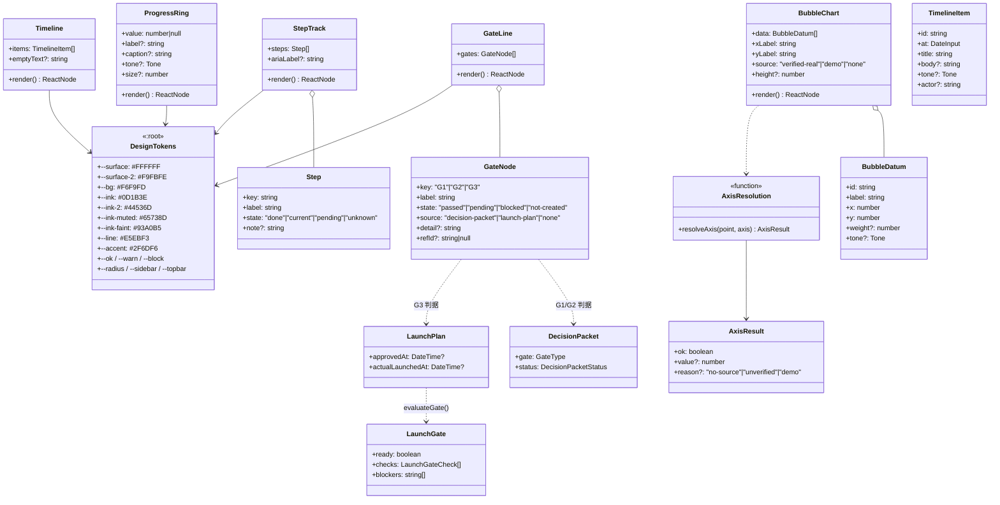
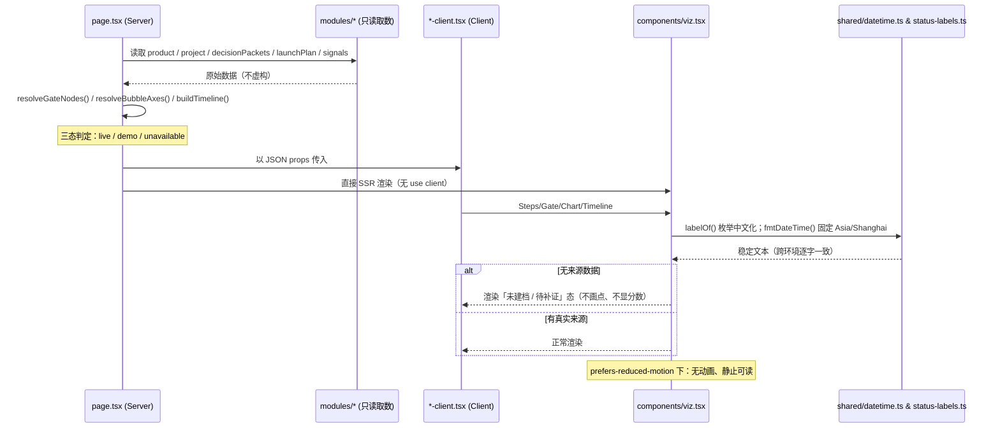
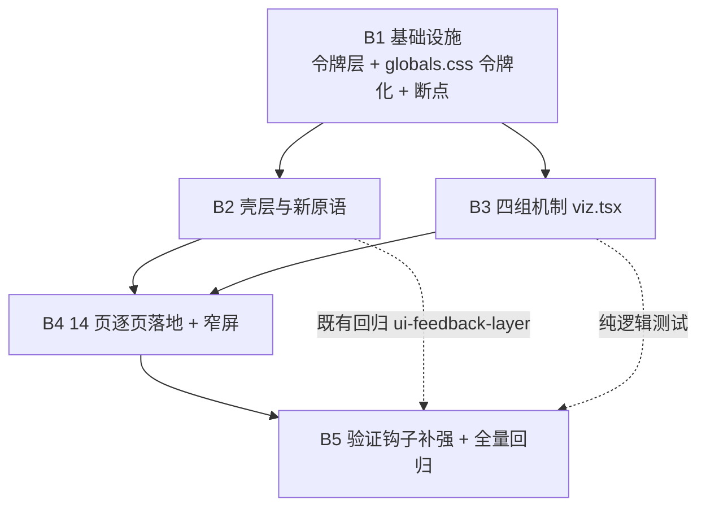
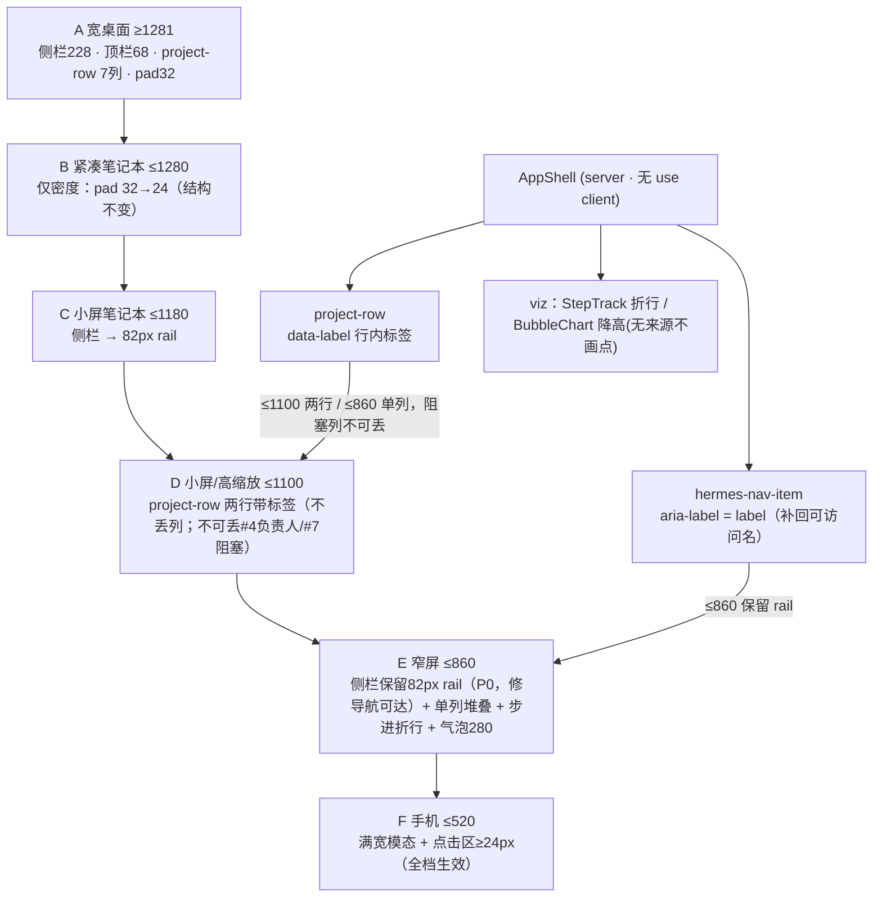

# HERMES 前端视觉系统迁移设计 · paper/teal → Quiet Enterprise

> 状态：设计（不含实现代码）｜作者：Architect（Bob）｜日期：2026-09-17
> 主工程：`/Users/exasdwyh/Documents/VScode/PM-Agent/hermes-next`
> 参考包（只读）：`/Users/exasdwyh/Downloads/hermes-frontend-v2/`

## 0. 结论摘要（TL;DR）

| 决策点 | 结论 |
|---|---|
| globals.css 迁移策略 | **令牌化改造（in-place）**，保留全部类名、只替换内部色值/尺寸。不做整体重写。 |
| 令牌层落点 | 新增 `:root` 语义令牌块（`--surface/--ink/--line/--accent/--ok/--warn/--block/...`），其余规则把 115 个 hex + 82 个 rgba **按语义聚类**替换为 `var(--token)`。 |
| 回退路径 | 单提交可 `git revert`；另保留一份 `[data-palette="paper"]` 覆盖块，可用 `<html data-palette>` 一行切回 paper/teal。 |
| 新增共享组件 | `src/components/viz.tsx`：`StepTrack / GateLine / ProgressRing / BubbleChart / Timeline`，**纯展示、无 `"use client"`、无 hook**（对齐 `ui.tsx`），服务端与客户端均可 import。 |
| 四组机制数据 | 步进条=项目/产品阶段枚举；门槛线=**两套放行机制如实并列**（G1/G2 走 `DecisionPacket`，G3 走 `LaunchPlan`，G2 为空门恒「未建档」）；气泡图=**当前无可靠来源 → 整体「未建档」，不画点**；时间线=审计/决策事件，时间一律走 `datetime.ts`。 |
| 断点 | 新增 **1180（侧栏收图标栏）/ 860（隐藏侧栏 + 顶栏 static + KPI 两列）**，与既有 1100/960/900/800/520 **合并而非叠加冲突**（见 §6）。 |
| 实现批次 | **5 批（B1–B5）**，每批可独立验证。 |
| 最大风险 | ① 14 个页面 `tsx` 内**仍有内联 hex**（`project-detail-client.tsx` 密集），CSS 令牌化覆盖不到；② 气泡图首版几乎必然「未建档」，需产品确认；③ 侧栏深色→浅色属观感级功能改变。 |
| 严禁照抄 | 参考包示例数据（AOS/AKK/LCE/BPL）、「98% 系统运行正常」、无来源的「高/中/低匹配度」、硬编码 58% 环形进度。见 §9。 |

---

# Part A：系统设计

## 1. 实现路径

### 1.1 核心难点

1. **色值黑洞**：`globals.css` 547 行里 215 处 hex（**115 个不同值**）＋ 114 处 rgba（**82 个不同值**）。同一语义散成多种写法（如次级文字色有 `#7d898e`×10、`#849095`×7、`#8a9698`×4、`#8a9799`×4、`#859095` …）。直接替换必然漏改、且制造新的「同义不同写」。
   → 对策：**先聚类再替换**，用可复算的脚本产出「旧值 → 令牌」映射（§1.3、§一）。
2. **类名即契约**：多处类名被组件 + 测试双重引用（`.hermes-banner.is-danger`、`.hermes-board-*`、`.project-row`、`.hermes-nav-progress`、`.hermes-sr-only`、`.hermes-thinking-*`、`.hermes-center-card`、`.hermes-empty`、`.hermes-glass`…）。`tests/ui-feedback-layer.ts` 直接断言其中若干个存在。
   → 对策：**只改值、不改名**；并加「语义类名冻结」断言（§7）。
3. **两条不能被样式层破坏的硬约束**：路线级 `loading.tsx` 必须为 0（P0，守卫 2b 遍历全仓）；降动画下所有新动画必须**静止可读**而非冻结在半途。
4. **证据契约**：门槛线/气泡图任何「看起来有数据」的呈现都必须可追溯到 live/demo/unavailable，禁止硬编码数字。

### 1.2 框架与库选择（沿用，不新增）

项目已用 **Next.js 15 App Router + React 19 + Prisma 6 + Tailwind（仅 base/components/utilities 三指令，实际样式在 globals.css）**。
本次为**纯表现层迁移**，**不新增任何前端依赖**（不引图表库/动画库/CSS-in-JS），理由：
- 图表（气泡/环形/步进/时间线）几何极简单，20 行 CSS + 少量内联定位即可，引库会带来 SSR/水合与包体风险；
- 本仓已有「零依赖共享原语」范式（`src/components/ui.tsx`、`src/shared/status-labels.ts`），新增依赖会破坏该范式的一致性；
- 参考包本身也是零依赖静态实现（`assets/styles.css` 20KB），语义上不需要额外库。

### 1.3 归类方法（可复算，engineer 可自行重跑）

**不要靠肉眼**。用下面脚本枚举 + 聚类（先 strip 注释，避免把注释里的色值算进去）：

```bash
cd hermes-next
node -e '
const fs=require("fs");
const clean=fs.readFileSync("src/app/globals.css","utf8").replace(/\/\*[\s\S]*?\*\//g,"");
// 1) hex
const hex=clean.match(/#[0-9a-fA-F]{3,8}\b/g)||[];
// 2) rgba/rgb
const rgb=clean.match(/rgba?\([^)]*\)/g)||[];
const tally=a=>{const m={};a.forEach(x=>{const k=x.replace(/\s+/g,"").toLowerCase();m[k]=(m[k]||0)+1});return m};
const hexT=tally(hex), rgbT=tally(rgb);
// 3) 按 selector/property 归类（第二遍扫行）
const roleOf=(line)=>{ if(/color:|text-fill/.test(line))return"ink";
  if(/background|gradient/.test(line))return"surface"; if(/border/.test(line))return"line"; return"other"};
console.log("hex uniq",Object.keys(hexT).length,"of",hex.length);
console.log("rgb uniq",Object.keys(rgbT).length,"of",rgb.length);
'
```

**聚类判据（三类信息合判，不只看色值）**：
1. **出现位置（role）**：属性是 `color`（文字）／`background|linear-gradient`（面）／`border|box-shadow`（线/影）／`::before` 装饰；
2. **HSL 聚类**：把每个 hex 转 HSL，(hue 分桶 / saturation 高低 / lightness 分档) 三轴聚类；
3. **使用它的 class 语义**：出现在 `.is-ok/.is-danger/.is-warn` 附近的归入状态色；出现在侧栏/hero/品牌区的归入品牌/装饰色（多数将被**整体退役**）。

实测产出（本次已跑）：
- hex 出现 **215** 次 / **115** 个不同值；
- rgba/rgb 出现 **114** 次 / **82** 个不同值；
- 现有 `:root` 只有 7 个变量，且 `var(--*)` 仅被使用 **50** 次（`--line`×25、`--ink`×24、`--paper`×1）——即 **95% 颜色是字面量**。

聚类结论：115 个 hex 可收敛为 **约 11 个色族**（见 §一 映射表）。

### 1.4 架构模式

- **展示层分层**：`globals.css`（设计令牌 + 语义类） → `src/components/ui.tsx`（无状态原语） → `src/components/viz.tsx`（新增可视化原语） → 各 `*-client.tsx`（页面装配）。
- 组件一律**服务端优先**：`viz.tsx` 不写 `"use client"`，由服务端页面直接渲染（SSR 产出静态 HTML）；需要交互的仅用 CSS `:hover` 与原生 `<details>`，不引入 React 状态、不创建客户端边界。

---

## 2. 文件清单

**新增**
```
src/app/theme/quiet-enterprise.css        # 令牌层（:root + 可选 [data-palette=paper] 回退块）
src/components/viz.tsx                    # StepTrack / GateLine / ProgressRing / BubbleChart / Timeline
docs/class-diagram.mermaid                # 本设计类图
docs/sequence-diagram.mermaid             # 本设计时序图
tests/ui-quiet-enterprise.ts              # 新增验证钩子（源码守卫 + Playwright 运行时）
```

**修改（表现层，禁止碰 api/modules/prisma）**
```
src/app/globals.css                       # 令牌化：115 hex + 82 rgba → var(); 断点合并
src/app/layout.tsx                        # 仅当采用 data-palette 开关时改 1 行（<html data-palette>）
src/components/app-shell.tsx              # 壳层：浅色侧栏 228 / 顶栏 68 吸顶 + 图标栏
src/components/ui.tsx                     # 原语：把内联 hex（如 #8a9698）改为 var()
src/components/icons.tsx                  # 如参考包图标集需要补 glyph（默认不动）
src/app/page.tsx, workbench-client.tsx    # 首页（含 KPI、步进、门槛示意）
src/app/products/page.tsx, products-client.tsx
src/app/products/[id]/page.tsx, product-overview-client.tsx, launch-tab.tsx,
        revision-panel.tsx, cost-calculator.tsx
src/app/opportunities/page.tsx, opportunities-client.tsx
src/app/projects/[id]/page.tsx, project-detail-client.tsx   # ★ 内联 hex 密集，逐处替换
src/app/{advisor,consultation,dashboard,knowledge,login,organization,settings,trace,war-room}/*.tsx
```

**禁止修改**：`src/app/api/**`、`src/modules/**`、`prisma/**`、`src/shared/status-labels.ts`、`src/shared/datetime.ts`、`src/components/nav-progress.tsx` 的既有契约、`src/components/reason-dialog.tsx` 的既有契约。

---

## 3. 数据结构与接口



## 4. 程序调用流程



---

## 5. 待明确事项（Part A）

1. 侧栏由**深色 190px** 改为**浅色 228px**，属观感级功能改变，需确认。
2. 气泡图首版大概率「未建档」（见 §四），需确认接受「先出坐标框 + 来源说明」。
3. 顶栏由 56px 圆角改为 **68px 吸顶毛玻璃**，会改变现有首页视觉节奏。
4. 是否保留 `.hermes-hero`（参考包首页用山景 + 浅色 hero，现为深色照片 hero）。

---

# Part B：任务分解

## 6. 依赖包

**无新增依赖**。仅使用既有：
```
- next@15 (App Router)     : 路由与 SSR
- react@19                 : 组件
- tailwindcss              : 仅 base/components/utilities 三指令（不放自定义色板）
- prisma@6 + @prisma/client: 只读取 GateType / DecisionPacket / LaunchPlan（禁止改 schema）
- node:test / tsx          : 测试（既有 scripts/run-test.ts）
- playwright               : 运行时走查（既有用法）
```

## 7. 任务列表（按依赖排序，**恰好 5 批**）

> 说明：团队任务系统中「工程实现」为单任务（#14）。以下 B1–B5 是工程师在该任务内的**可独立验证批次**，满足「≤5 任务、每批 ≥3 文件、第一批为基础设施」。

### B1 · 基础设施：令牌层 + globals.css 令牌化 + 断点合并
- **源文件**：`src/app/theme/quiet-enterprise.css`（新）、`src/app/globals.css`、`src/app/layout.tsx`（仅 data-palette 开关，可选）
- **依赖**：无
- **内容**：写入 §一 的 `:root` 令牌集；按 §一 映射表把 115 hex + 82 rgba 全部替换为 `var(--token)`；合并断点（§6）；保留所有类名。
- **独立验证**：`tsc --noEmit`；`ui-feedback-layer.ts` 源码守卫（2/2b/3–7）全绿；`grep` 断言无遗留 paper/teal 专属 hex。
- **优先级**：P0

### B2 · 壳层与新原语视觉落地
- **源文件**：`src/components/app-shell.tsx`、`src/components/ui.tsx`、`src/app/globals.css`（壳层/原子类段）
- **依赖**：B1
- **内容**：浅色侧栏 228 / 图标栏；顶栏 68 吸顶；徽章/按钮/面板/表格/提示条换 Quiet 令牌；`ui.tsx` 内联 hex 改 `var()`。
- **独立验证**：`ui-feedback-layer.ts` 第 2 组（app-shell 无 `"use client"`、NavProgress 契约不变）全绿；全仓 `loading.tsx` 计数=0。
- **优先级**：P0

### B3 · 四组机制共享组件 `viz.tsx`
- **源文件**：`src/components/viz.tsx`（新）、`tests/ui-quiet-enterprise.ts`（新，组件三态断言部分）、`globals.css`（viz 原子类段）
- **依赖**：B1
- **内容**：实现 `StepTrack / GateLine / ProgressRing / BubbleChart / Timeline`，含三态退化与降动画兜底（§三、§四）。
- **独立验证**：`NODE_OPTIONS= ./node_modules/.bin/tsx scripts/run-test.ts tests/ui-quiet-enterprise.ts`（纯逻辑部分：空数据/无来源/确定性渲染）。
- **优先级**：P0

### B4 · 14 页逐页落地 + 窄屏断点
- **源文件**：14 个 `page.tsx` 与其 `*-client.tsx`（含 `project-detail-client.tsx`、`product-overview-client.tsx`、`launch-tab.tsx`、`opportunities-client.tsx`、`workbench-client.tsx`）、`globals.css`（断点段）
- **依赖**：B2、B3
- **内容**：接入四组机制到对应页（首页步进/门槛、产品详情步进 + G 门槛、机会雷达气泡、追溯时间线）；替换页面内联 hex；390px 无横向溢出。
- **独立验证**：逐页截图；`tests/ui-quiet-enterprise.ts` 运行时（390 溢出、reduced-motion、`.project-row` 首列宽度）。
- **优先级**：P0

### B5 · 验证钩子补强与全量回归收尾
- **源文件**：`tests/ui-quiet-enterprise.ts`（补齐运行时断言）、`tests/ui-feedback-layer.ts`（仅新增守卫，不删既有）
- **依赖**：B1–B4
- **内容**：落地 §7 全部新增断言 + 变异验证。
- **独立验证**：`bash scripts/acc-server.sh tests/acceptance-authz-matrix.test.ts tests/acceptance-product-center.test.ts tests/acceptance-b01-http.ts tests/ui-b01-evidence.ts tests/ui-feedback-layer.ts tests/acceptance-http-errors.ts`；`tsc --noEmit`。
- **优先级**：P0

## 8. 共享知识（跨切面约定）

```
- 颜色：一律用语义令牌 var(--surface/--ink/--ink-2/--ink-muted/--ink-faint/--line/--accent/--ok/--warn/--block)
        禁止新增字面量 hex/rgba（含 tsx 内联 style）。同义色必须合并到同一令牌。
- 枚举：一切枚举/动作名/字段名 → src/shared/status-labels.ts（零依赖，客户端可直接 import）；禁止裸渲染。
- 时间：一切日期时间 → src/shared/datetime.ts（固定 Asia/Shanghai + 显式 locale）；禁止裸 toLocaleTimeString/Date。
- 空态 vs 加载：Empty=空态、Thinking=加载中，不得混用。
- 弹窗：零原生 alert/confirm/prompt；用 useReasonDialog()/Modal/结果横幅。
- 加载：禁止新增路线级 loading.tsx（App Router 流式边界会让 notFound() 丢 404、redirect 推迟到 hydrate 后）。
- 动效：任何新增动画必须在 prefers-reduced-motion 下退化为静止可读（非半途冻结）。
- 证据：外部数据三态 live/demo/unavailable；无证据只显示「未建档/待补证/未验证」，禁止虚假精确评分。
- 本次范围：仅表现层，不得改 src/app/api/**、src/modules/**、prisma/**。
```

## 9. 任务依赖图



---

# 一、旧 → 新 色值与令牌映射表

## 1.1 新的 `:root` 令牌集合（语义命名）

```css
/* src/app/theme/quiet-enterprise.css —— 唯一色值事实来源 */
:root {
  /* 面 surface */
  --bg:            #F6F9FD;   /* 冷灰底（替代 paper #eeece5） */
  --surface:       #FFFFFF;
  --surface-2:     #F9FBFE;
  --surface-soft:  #F5F8FD;   /* hover / 次级行 */
  --surface-glass: rgba(255,255,255,.92); /* 顶栏毛玻璃 */

  /* 墨 ink（文字四级） */
  --ink:        #0D1B3E;  /* 主文字（替代 #0d1b29） */
  --ink-2:      #44536D;  /* 次级正文 */
  --ink-muted:  #65738D;  /* 说明文字 */
  --ink-faint:  #93A0B5;  /* 时间戳/占位/最弱 */

  /* 线 line */
  --line:        #E5EBF3;  /* 通用分隔（替代 rgba(39,61,72,.13)） */
  --line-strong: #D6E0ED;  /* 描边（按钮/输入框） */
  --line-field:  #C7D4E4;  /* 输入框边界 */

  /* 强调 accent（替代全部 teal/cyan） */
  --accent:       #2F6DF6;
  --accent-hover: #245CD8;
  --accent-bg:    #EAF2FF;  /* 选中/信息底 */
  --accent-ring:  #9DB8F3;  /* focus ring */
  --navy:         #0B1B3B;  /* 品牌深块（monogram/brand-mark） */

  /* 状态语义 ok / warn / block（+ 各自 ine/bg/line） */
  --ok:       #22A06B;  --ok-ink:    #18794E;  --ok-bg:    #EAF8F2;  --ok-line:    #BFE5D4;
  --warn:     #F59E42;  --warn-ink:  #8C5A10;  --warn-bg:  #FFF4E7;  --warn-line:  #F2D5A6;
  --block:    #EF5C5C;  --block-ink: #B42318;  --block-bg: #FFF1F1;  --block-line: #F3C6C2;
  --neutral-ink: #68768D; --neutral-bg: #F0F3F7; --neutral-line: #E1E6EE;

  /* 几何 */
  --radius:     14px;
  --radius-sm:  10px;
  --radius-xs:  9px;
  --shadow:      0 10px 30px rgba(34,62,103,.06);
  --shadow-soft: 0 4px 16px rgba(34,62,103,.05);
  --sidebar:     228px;
  --sidebar-rail: 82px;
  --topbar:      68px;
}
```

> 旧 `--paper/--teal/--copper/--green/--muted` 五个变量**保留为兼容别名**（`--paper: var(--bg); --teal: var(--accent); --copper: var(--warn-ink); --green: var(--ok); --muted: var(--ink-muted);`），使任何遗漏的旧引用不炸。

## 1.2 旧色值 → 新令牌 对照表（按聚类，含合并说明）

**A. 墨/中性文字族（灰青、低饱和）** —— 目标：4 个令牌

| 旧值 | 次数 | 新令牌 | 说明 |
|---|---|---|---|
| `#0d1b29` | 1 | `--ink` | 原 `--ink` |
| `#263842` | 2 | `--ink-2` | 分层设计正文 |
| `#4d5c61` | 7 | `--ink-2` | 正文次级（合并） |
| `#4f5f66`,`#516269`,`#52656c`,`#5b696e`,`#5d6a70`,`#5f6e75`,`#64737a`,`#69747b`,`#6d7b80`,`#708087` | 各 1–3 | `--ink-2` | 均「次级正文」，合并 |
| `#76808a` | 1 | `--ink-muted` | 原 `--muted` |
| `#7d898e` | **10** | `--ink-muted` | **同义不同写代表**：全部次级说明文字 |
| `#78858a`,`#78868c`,`#7a858a`,`#7e898e`,`#829094` | 各 1–3 | `--ink-muted` | 合并 |
| `#849095` | **7** | `--ink-faint` | 更弱（`small`/`hint`） |
| `#859095`,`#8a9698`,`#8a9799`,`#8c999b`,`#91a0a1`,`#98a2a5`,`#99a4a5`,`#a9b3b6`,`#9aa4a5`,`#9aa4a6` | 各 1–4 | `--ink-faint` | 合并（时间戳/占位） |
| `#738084`,`#7c8e93`,`#6f7d82`,`#829094`,`#91a2a5`,`#8b9ba0` | 各 1–2 | `--ink-faint` | 侧栏/表头弱字 |

**B. 强调/青蓝族（原 teal/cyan）** —— 目标：全部并入 `--accent` 族

| 旧值 | 次数 | 新令牌 |
|---|---|---|
| `#075b72`,`#0c6b88`,`#0c5b70`,`#0d6d86`,`#0a5068`,`#08657d`,`#07445b`,`#0b5269`,`#15728b` | 各 1–5 | `--accent`（深色变体 → `--accent-hover`） |
| `#14bfe9`,`#2aaac4`,`#1ba1bd`,`#237eb9`,`#4da8da`,`#35d7ff`,`#35a8c4`,`#0e97b8` | 各 1–4 | `--accent-ring` / 装饰（多数退役） |
| `#0a4f60`,`#0c7c9b`（Thinking 标签兜底色） | 各 1–6 | `--accent-hover`（保持可读对比度） |
| `#e4f5fa`,`#e5f5fb`,`#e9f5fd`,`#eaf2ff` | 各 1–4 | `--accent-bg` |
| `#0d2026`,`#0c222b`,`#0a171d`,`#07171f`（深色侧栏/hero） | 各 1 | **退役**（侧栏转浅色，hero 可选移除） |

**C. 铜/暖色族（原 copper）** —— 目标：**整体退役**（Quiet Enterprise 无铜色）

| 旧值 | 次数 | 新令牌 |
|---|---|---|
| `#8d7663`（`.eyebrow`/`.hermes-section-label` 铜字） | 3 | `--ink-faint` |
| `#bd8154`,`#ca8c59`,`#b9784d`,`#a96641`,`#dba445` | 各 1–3 | `--warn` 族（仅当表达「提醒」时）/ 其余退役 |
| `#d3a17c`,`#7a4d41`,`#d6b08a`,`#b98a5f`,`#f5d4a6`,`#dcb28b`,`#d4ae86` | 各 1–2 | **退役**（头像/hero 装饰） |

**D. 成功/绿族** —— `--ok` 族

| 旧值 | 次数 | 新令牌 |
|---|---|---|
| `#0c9b78`,`#0d9b7a`,`#0d9b78`,`#159d7c`,`#21ad8b`,`#25a27f`,`#13aa7b` | 各 1–3 | `--ok` |
| `#0c7a5f`,`#0c7a5f` | 2 | `--ok-ink` |
| `#2ce7bf`,`#e8f8f2`,`#e6f7f1`,`#bfe8dc` | 各 1–4 | `--ok` / `--ok-bg` / `--ok-line` |

**E. 警示/橙族** —— `--warn` 族

| 旧值 | 次数 | 新令牌 |
|---|---|---|
| `#e8b04b`,`#dba445` | 各 1–2 | `--warn` |
| `#8a6212`,`#8a6320` | 各 1–2 | `--warn-ink` |
| `#fdf3e3`,`#f0dcb6`,`#ecd9a8` | 各 1 | `--warn-bg` / `--warn-line` |

**F. 危险/红族** —— `--block` 族

| 旧值 | 次数 | 新令牌 |
|---|---|---|
| `#9e4636` | **5** | `--block-ink` |
| `#9e4c3d`,`#a8523f`,`#b42318` | 各 1 | `--block-ink` |
| `#d94b4b` | 2 | `--block` |
| `#e7b5a8`,`#f2cdc4`,`#fdeeea`,`#fff0eb` | 各 1–3 | `--block-line` / `--block-bg` |

**G. 面/线族（含全部 rgba）** —— 见下

| 旧值模式 | 新令牌 |
|---|---|
| `#fff / #ffffff / rgba(255,255,255,.x)` | `--surface` / `--surface-glass` / `--surface-soft`（按不透明度归三档） |
| `rgba(39,61,72,.13)` = 原 `--line` | `--line` |
| `rgba(36,66,74,.08)`,`rgba(25,65,76,.13)` | `--line` / `--line-strong` |
| `rgba(30,67,78,.16)`（表单边界） | `--line-field` |
| `rgba(16,133,165,.xx)`,`rgba(7,91,114,.xx)`,`rgba(12,107,136,.xx)`（teal 透明底/边） | `--accent` 派生（用 `color-mix` 或预置 `--accent-bg/-ring/-line`） |
| `rgba(244,242,235,.xx)`,`rgba(245,244,239,.xx)`,`rgba(232,231,223,.xx)`（纸感渐层） | **退役**（改 `--bg` 纯冷灰） |
| `rgba(5,20,28,.46)`,`rgba(9,24,51,.28)`（遮罩） | `rgba(9,24,51,.28)` → 新增 `--overlay` |

> 统计口径：**115 hex → 11 色族 → 约 22 个令牌**；82 rgba → 收敛为约 8 个表面/线/遮罩令牌。这就是「同义不同写必须合并」的量化依据。

## 1.3 归类方法（复述，写入给 engineer）

1. `node` 脚本枚举 hex + rgba → 频次表（§1.3 脚本）；
2. 对每个色值求 HSL，按 (hue 桶 / sat 高·低 / lightness 三档) 聚类；
3. 用 `grep -n` 反查该色值所在行 → 归属的 selector 与 property，判定 role（ink/surface/line/state）；
4. 高频同族（≥3 次）**必须**合并到同一令牌；低频装饰色若无语义 → 退役；
5. 替换后跑一次同样脚本，断言 **unique hex/rgba = 0**（令牌层除外）。

---

# 二、globals.css 迁移策略

## 2.1 选择：**令牌化改造（in-place）**，不作整体重写

**理由**
1. **类名是外部契约**：`tests/ui-feedback-layer.ts` 直接断言 `.hermes-nav-progress`、`.hermes-nav-progress-note`、`.hermes-sr-only`、`.hermes-center-card` 等存在；`ui.tsx`/`app-shell.tsx`/各 client 组件按名引用 60+ 个 `hermes-*` 与 `project-row`/`panel-heading`。整体重写必然造成测试红 + 组件失效。
2. **渐进可验证**：in-place 可按段替换、逐批验证；重写只能一次性炸。
3. **回退成本**：in-place 支持「换令牌块即换主题」，重写无法回退。

## 2.2 执行方式（三段式）

1. **新增令牌层** `src/app/theme/quiet-enterprise.css`，在 `globals.css` **首行** `@import "./theme/quiet-enterprise.css";`（**必须在 `@tailwind` 之前或之后均可，但要早于所有规则**；建议放最顶部）。
2. **值替换**：把每个 hex/rgba 按 §1.2 映射改成 `var(--token)`。**只改 `:` 右侧的值，不改选择器、不改类名、不改属性名**。
3. **几何替换**：圆角统一 9/10/14px；侧栏宽 190→228；顶栏高 56→68；间距带沿用参考包（14/18/26px）。**只动这些数值，不动结构。**

## 2.3 回退路径（两条，任选其一）

- **主路径**：整个迁移落成**一个 commit**，回退 = `git revert <sha>`。
- **运行时开关（推荐同时具备）**：把旧 paper/teal 的色值收敛进 `[data-palette="paper"]` 覆盖块，新值放 `:root`。切换 = 在 `layout.tsx` 的 `<html>` 上加/去 `data-palette="paper"`（1 行）。这样无需重新构建即可对比两套视觉、也便于走查。

## 2.4 避免丢语义类（保护清单 + 冻结断言）

**必须逐字保留的类名**（被测试或组件引用）：
```
.hermes-shell .hermes-sidebar .hermes-nav .hermes-nav-item .hermes-nav-item.is-active
.hermes-nav-divider .hermes-nav-more .hermes-nav-footer .hermes-sidebar-bottom
.hermes-status-dot.is-ok/-warn/-neutral .hermes-profile .hermes-avatar
.hermes-content .hermes-glass .hermes-topbar .hermes-topbar-title .hermes-identity
.hermes-page-heading .eyebrow .hermes-stack .hermes-panel .hermes-panel-head
.hermes-stat-grid .hermes-stat.is-alert/.is-good .hermes-badge.is-ok/-warn/-danger/-info/-neutral/-brand
.hermes-primary-btn .hermes-outline-btn .hermes-ghost-btn .hermes-danger-btn .hermes-icon-btn .hermes-btn-sm
.hermes-label .hermes-input .hermes-select .hermes-textarea .hermes-form-grid
.hermes-banner.is-ok/.is-danger/.is-info/.is-warn
.hermes-list .hermes-row .hermes-row.is-selected .hermes-row-head .hermes-row-title .hermes-row-meta .hermes-row-body
.hermes-empty .hermes-table .hermes-mono .hermes-timeline .hermes-progress
.hermes-kv .hermes-modal .hermes-modal-backdrop .hermes-modal.is-wide .hermes-modal-actions
.hermes-tabs .hermes-tabs button.is-active .hermes-todo
.hermes-login .hermes-login-card .hermes-nav-progress .hermes-nav-progress-note .hermes-sr-only
.hermes-center-page .hermes-center-card .hermes-center-actions
.hermes-thinking .hermes-thinking-dots .hermes-thinking-label
.hermes-board .hermes-board-col .hermes-board-col-head .hermes-board-card .hermes-board-card-meta
.hermes-brief-* .hermes-theme-* .hermes-executive-* .hermes-blocker-* .hermes-action-cta
.project-table-head .project-row .panel-heading .panel-controls .compact-search
```
→ 新增断言：以上每个名字必须仍出现在 `globals.css`（去注释后）。

## 2.5 ★ `.project-row` 不可回退警告

`.project-row` 与 `.project-table-head` 的列模板当前为 **7 列**：
`minmax(200px,2.4fr) 104px 84px minmax(104px,1fr) 116px 60px 88px`。
**第一格是「项目名」且 min 为 200px**——这是最近修过的缺陷（曾把第一格写成 **28px**，给了并不存在的「行序号」列，导致整行错位）。迁移时必须：
- 不改 `grid-template-columns` 的列数与第一格 `minmax(200px,…)`；
- 保留 `@media(max-width:1100px)` 的 5 列降级与 `@media(max-width:800px)` 的 3 列降级及 `nth-child` 隐藏规则；
- 新增断言：≥1180 时 `.project-row` 计算出的首列轨道 ≥ 200px（§7）。

---

# 三、新增共享组件接口

## 3.1 放置位置与理由

`src/components/viz.tsx`（**新文件，无 `"use client"`、无 hook、无副作用**）。

- **为什么放 `src/components/`**：与既有 `ui.tsx` 同级，服务端页面可直接渲染（SSR HTML），客户端组件也可 import——**不制造客户端边界**（对齐 `app-shell.tsx` 引用 `nav-progress.tsx` 的既有姿势）。
- **为什么不放 `src/app/**`**：它们被多页复用，属共享层。
- **为什么不合并进 `ui.tsx`**：`ui.tsx` 是「无状态原语」，可视化组件几何更重，单开文件便于 review 与 tree-shake（与 `reason-dialog.tsx` 单开的先例一致）。

## 3.2 TypeScript 签名

```ts
import type { ReactNode } from "react";
import type { DateInput } from "@/shared/datetime";

export type VizTone = "accent" | "ok" | "warn" | "block" | "neutral";

/* ---------- StepTrack 产品阶段步进条 ---------- */
export type StepState = "done" | "current" | "pending" | "unknown";
export interface StepItem {
  key: string;
  label: string;              // 必须已过 status-labels（如 PROJECT_STAGE_LABELS）
  state: StepState;
  note?: string;              // 可空
}
export interface StepTrackProps {
  steps: StepItem[];
  ariaLabel?: string;         // 默认「阶段进度」
  className?: string;
}
export function StepTrack(props: StepTrackProps): ReactNode;

/* ---------- GateLine G1/G2/G3 门槛线 ---------- */
export type GateState = "passed" | "pending" | "blocked" | "not-created";
export type GateSource = "decision-packet" | "launch-plan" | "none";
export interface GateNode {
  key: "G1" | "G2" | "G3";
  label: string;              // 「研发打样门」…
  state: GateState;
  source: GateSource;         // 如实标注机制来源（两套机制不合并）
  detail?: string;            // 人类可读（来自既有 gate.summary/checks）
  refId?: string | null;      // 指向 DecisionPacket / LaunchPlan
}
export interface GateLineProps {
  gates: GateNode[];
  ariaLabel?: string;
  className?: string;
}
export function GateLine(props: GateLineProps): ReactNode;

/* ---------- ProgressRing 环形进度 ---------- */
export interface ProgressRingProps {
  value: number | null;       // 0..100；null = 无数据（渲染未建档）
  label?: string;
  caption?: string;
  tone?: VizTone;             // 默认 accent
  size?: number;              // 默认 126
}
export function ProgressRing(props: ProgressRingProps): ReactNode;

/* ---------- BubbleChart 机会气泡图 ---------- */
export interface BubbleDatum {
  id: string;
  label: string;
  x: number;                  // 价值轴 0..100（仅当 resolveAxis ok）
  y: number;                  // 匹配度轴 0..100
  weight?: number;            // 仅影响半径，不影响坐标
  tone?: VizTone;
}
export interface BubbleChartProps {
  data: BubbleDatum[];        // 调用方必须已过滤为「有来源」的点
  xLabel: string;
  yLabel: string;
  source: "verified-real" | "demo" | "none";
  height?: number;            // 默认 340
  className?: string;
}
export function BubbleChart(props: BubbleChartProps): ReactNode;

/* ---------- Timeline 决策/审计时间线 ---------- */
export interface TimelineItem {
  id: string;
  at: DateInput;              // 由组件内部走 fmtDateTime
  title: string;
  body?: string;
  tone?: VizTone;
  actor?: string;
  refId?: string | null;
}
export interface TimelineProps {
  items: TimelineItem[];
  emptyText?: string;         // 默认「暂无记录。」
  ariaLabel?: string;
  className?: string;
}
export function Timeline(props: TimelineProps): ReactNode;
```

## 3.3 三种退化形态（每个组件都要实现）

| 组件 | ① 降动画（prefers-reduced-motion） | ② 空数据（length=0） | ③ 无来源数据（source="none"/value=null） |
|---|---|---|---|
| StepTrack | 无过渡/无推进动画；连接段用**静态背景色**表示「已完成」，不靠 `width` 动画 | 整条渲染 `data-empty="true"`，节点全 `unknown`，右侧给「阶段未建档」灰字 | 无此态（阶段来自枚举，必有值） |
| GateLine | 无动画（门点是静态填充/空心） | `data-empty="true"`，三段全 `not-created` | **关键**：`source==="none"` 或 `state==="not-created"` → **空心点 + 「未建档」**，绝不显示通过/分数 |
| ProgressRing | **不加动画**（纯 conic-gradient 静态）；若未来加 mount 过渡，reduce 下退化为无过渡 | `value===null` → 渲染中性空环 + 「未建档」 | `value===null` 即③；不显示任何百分比 |
| BubbleChart | 点静止（无入场动画/无缩放过渡） | 渲染坐标框 + 居中「未建档 / 待补证」 | **关键**：`source!=="verified-real"` 或 `data.length===0` → **不画任何点**；`source==="demo"` 额外渲染警示条「演示数据，不得作为决策依据」 |
| Timeline | 无动画（节点静态） | `<Empty>{emptyText}</Empty>`（真缺口态，用 Empty 不用 Thinking） | 无此态（事件为空即②） |

> 降动画的三条实现硬规则：
> 1. `ProgressRing` **不引入动画**——`conic-gradient` 是静态着色，本就可读（参考包 `.progress-ring` 即如此）；风险只在于「若给它加 mount 动画，reduce 下冻结在 0% ≈ 空环」，因此**明令不加**。
> 2. `StepTrack` 的「已完成」段用 `background: var(--accent)` 静态表示，**不用 `width` 从 0 过渡到 100%**。
> 3. 所有 viz 动画（若有）集中在 `@media (prefers-reduced-motion: no-preference)` 内声明，reduce 分支默认「零动画」。

---

# 四、数据来源与三态处理

## 4.1 门槛线（GateLine）—— **两套放行机制如实并列，不统一**

本仓存在**两条独立的放行链路**，设计上必须**并列呈现、来源可见**：

| 节点 | 机制来源 | 数据表 / 函数 | 状态判据（如实读取，不改口径） |
|---|---|---|---|
| **G1 研发打样门** | `DecisionPacket` | `prisma.decisionPacket` where `gate = RESEARCH_SAMPLING_GATE` | `status`：`APPROVED`→passed；`DRAFT/IN_REVIEW`→pending；`CHANGES_REQUESTED/DEFERRED/REJECTED/WITHDRAWN`→blocked；**无记录**→not-created |
| **G2 生产门** | `DecisionPacket` | `prisma.decisionPacket` where `gate = PRODUCTION_GATE` | `GateType.PRODUCTION_GATE` **在本仓无任何代码写入**（全仓 grep：只在 `migration.sql` 与 `schema.prisma` 出现）。→ **恒为 `not-created`（空门）**，界面显示「未建档」，**不得**用 LaunchPlan 或其它数据替它凑数 |
| **G3 上市放行** | `LaunchPlan` | `prisma.launchPlan` + `modules/launch/service.ts#evaluateGate` | 无 plan→not-created；plan 存在且 `evaluateGate().ready===false`→blocked（`blockers` 作 detail）；`ready===true && !approvedAt`→pending；`approvedAt` 存在→passed（**获准≠已上市**）；`actualLaunchedAt` 存在→passed(已上市) |

**呈现要求**：每个门节点下方以小字标注 `依据：决策包` / `依据：上市计划`（来自 `source`）。**禁止**把 G1/G2/G3 抽象成一个统一的「gate 表」——它们背后是 `DecisionPacket` 与 `LaunchPlan` 两个实体，强行统一会掩盖「生产门尚无实现」这一真实事实（与「禁止虚假精确」同源）。

## 4.2 气泡图（BubbleChart）—— 两轴数据来源与判定

**价值轴（x）**：本仓与「机会」相关的数值字段只有两处：
- `SignalItem.valueTier`：取值 `high|normal|low`（**序数且常为 NULL**）；
- `SignalItem.importance`：`Int`，**默认值 1、无校准、非业务打分**。

判定逻辑（写入 `resolveAxis`）：
```ts
// 值轴：只有当存在「有明确依据的连续数值」时 ok=true
if (!signal.valueTier || !signal.valueReason) return { ok:false, reason:"unverified" }; // 无依据 → 不可用
if (重要性未校准) return { ok:false, reason:"no-source" };                              // importance 默认值不算数据源
// 结论：当前没有任何信号满足 x 轴条件
```
**禁止**把 `high/normal/low` 线性映射成 `100/50/0` 来凑点（那是「虚假精确」）。

**匹配度轴（y）**：本仓**信号层没有「公司匹配度」字段**。`COMPANY_FIT` 只存在于产品分析维度 `AnalysisDimensionKey.COMPANY_FIT`（且 `score` 可为 `null`），信号与产品不是同一实体，**不可直接搬运**。
→ 判定：**无来源 → `ok:false`**。若未来要映射到某产品的 `COMPANY_FIT`，必须先显式声明映射口径并经审批（本任务不改口径）。

**综合结论**：`BubbleChart` 只在 `data`（已过滤为 ok 的点）非空 **且** `source==="verified-real"` 时画点。**当前实现下 `data` 必然为空 → 气泡图整体显示「未建档」**。这是**正确行为**，不是缺陷：宁可不画，也不把没有数据源的维度画成「有数据」。

**三态标注**：页面上气泡图旁必须有一行来源说明（如「价值轴 / 匹配度轴当前无可靠数据源，暂不绘制」），`source` 值随图标小字可见。

---

# 五、文件级改动清单与实现顺序

| 批次 | 文件（相对 `hermes-next/`） | 依赖 | 独立验证 |
|---|---|---|---|
| **B1 基础设施** | `src/app/theme/quiet-enterprise.css`(新)、`src/app/globals.css`、`src/app/layout.tsx`(可选 data-palette) | — | `tsc --noEmit`；`ui-feedback-layer.ts` 源码守卫全绿；hex/rgba unique=0 脚本断言 |
| **B2 壳层与原语** | `src/components/app-shell.tsx`、`src/components/ui.tsx`、`globals.css`(壳层段) | B1 | `ui-feedback-layer.ts` 第 2 组全绿；`loading.tsx`=0 |
| **B3 机制组件** | `src/components/viz.tsx`(新)、`tests/ui-quiet-enterprise.ts`(新)、`globals.css`(viz 段) | B1 | `tsx scripts/run-test.ts tests/ui-quiet-enterprise.ts`（纯逻辑部分） |
| **B4 逐页落地** | 见下「14 页清单」、`globals.css`(断点段) | B2,B3 | 逐页截图 + 390 溢出断言 + `.project-row` 首列断言 |
| **B5 验证收尾** | `tests/ui-quiet-enterprise.ts`(补运行时)、`tests/ui-feedback-layer.ts`(仅新增) | B1–B4 | `bash scripts/acc-server.sh …`(六套件)；`tsc --noEmit` |

**B4 的 14 页清单**（路由 → 文件）：
```
/                   → src/app/page.tsx, workbench-client.tsx
/products           → products/page.tsx, products-client.tsx
/products/[id]      → products/[id]/page.tsx, product-overview-client.tsx,
                       launch-tab.tsx, revision-panel.tsx, cost-calculator.tsx
/opportunities      → opportunities/page.tsx, opportunities-client.tsx
/advisor            → advisor/page.tsx, advisor-client.tsx
/consultation       → consultation/page.tsx, consultation-client.tsx
/dashboard          → dashboard/page.tsx, dashboard-client.tsx
/knowledge          → knowledge/page.tsx, knowledge-client.tsx
/projects/[id]      → projects/[id]/page.tsx, project-detail-client.tsx ★内联 hex 密集
/login              → login/page.tsx
/settings           → settings/page.tsx
/trace              → trace/page.tsx, trace-client.tsx
/war-room           → war-room/page.tsx, war-room-client.tsx
/organization       → organization/page.tsx
```

**四组机制接入点**：
- ① 断点修复 → B1 的 `globals.css` 断点段（全站生效，无页面改动）。
- ② 阶段步进条 `StepTrack` → 首页 `workbench-client.tsx`（项目/产品阶段）、`products/[id]/product-overview-client.tsx`。
- ③ 门槛线 `GateLine` → `products/[id]/launch-tab.tsx`（G3）、`projects/[id]/project-detail-client.tsx`（G1/G2）。
- ④ 气泡图 `BubbleChart` → `opportunities-client.tsx`；`Timeline` → `trace-client.tsx` 与 `product-overview-client.tsx` 的「变更审计」段（替换现有 `.hermes-timeline`）。

---

# 六、窄屏断点方案

## 6.1 断点档位（目标）

| 档位 | 规则要点 |
|---|---|
| **≥1180** | 全量布局：侧栏 228px 浅色、顶栏 68px 吸顶毛玻璃、KPI 多列 |
| **861–1179** | **侧栏收成图标栏 82px**：隐藏 `wordmark/submark/nav 文本/侧栏底部 detail/用户名`；`content` margin-left 82px |
| **≤860** | **侧栏 `display:none`**；`content` 宽 100%；**顶栏转 `position:static`**（不再吸顶）；KPI/stat → 2 列；多列网格 → 1 列 |
| **≤520** | 沿用现有手机档：顶栏 `height:auto` 换行、h1 25px、身份选择器收窄、`eyebrow` 隐藏 |

## 6.2 与既有 1100/960/900/800/520 的合并（**不叠加冲突**）

现状断点：`1100`（workspace/side-detail/project-row）、`960`（overview-layout）、`900`（advisor）、`800`（侧栏→72px、hero、decision-strip、metrics、panel、project-row）、`520`（顶栏手机档）。

**必须处理的冲突**：`≤800` 块里有
```css
.hermes-sidebar { width:72px; }
.hermes-content { width:calc(100% - 72px); }
```
新增 `≤860` 会**同时命中**（800 ⊂ 860），二者对「侧栏是否存在」给出相反指令。
**决策**：
1. 把「侧栏宽度 / 内容宽度」相关声明从 `≤800` 块**移除**，集中到新的 `≤860` 块（侧栏 `display:none`、`content:100%`）。`≤800` 块**只保留与侧栏无关**的规则（hero、decision-strip、metrics、panel-heading、project-row、tabs、stat-grid）。
2. `≤800` 的 `.project-row{grid-template-columns:minmax(0,1fr) 92px 72px}` **保留**（侧栏隐藏下仍然成立）。
3. 新增 `≤860` 里 `.hermes-topbar{position:static}`；现有 `≤800` 的 `.hermes-topbar{height:auto;flex-wrap:wrap}` 保留（与 static 不冲突）。
4. `1101–1179` 区间**当前无规则**——属于图标栏 + 全宽 content，需在 B1 实测 `topbar` 搜索框宽度不溢出（`width:min(590px,55vw)`）。
5. `960 / 900 / 1100` 的网格规则**不动**，它们只影响具体组件网格，与侧栏无关。

## 6.3 390px 实测修复点（来自走查）

- 顶栏：`≤800` 已加 `height:auto+wrap`；`≤520` 再加 `padding:8px 10px`、`eyebrow` 隐藏、标题 `ellipsis`。→ 保留并纳入 §7 溢出断言。
- `hermes-identity span`（「当前身份（开发态）」）在 `≤520` 收起，仅留 `select`（功能不丢）。
- 表格/气泡图：给 `.hermes-table`、`.bubble-chart` 外层加 `overflow-x:auto` 兜底，避免整页横向滚动。

---

# 七、验证钩子

> 每条都要能**真的变红**（附变异验证方式）。全部落在 `tests/ui-quiet-enterprise.ts`（新），源码守卫部分沿用 `ui-feedback-layer.ts` 的 `walk/stripComments/hits` 工具。

| # | 断言 | 归属 | 如何证明「真的会变红」 |
|---|---|---|---|
| 1 | 路线级 `loading.tsx` 数量 = 0（加强：追加断言 `src/components/viz.tsx` **不得**含 `Suspense`/`loading`、且 B3 后重跑） | 源码级 | 新建 `src/app/loading.tsx` → 立即红（既有守卫 2b 已可证） |
| 2 | 枚举/轴标签无泄漏：`GateLine`/`BubbleChart` 渲染的文本不得含 `RESEARCH_SAMPLING_GATE`/`PRODUCTION_GATE`/`high`/`normal`/`camelCase` | 源码 + 运行时 | 把 `label` 直接传枚举原始值 → 红 |
| 3 | **门槛线在无来源时不得渲染成有数据**：`GateLine` 传 `source:"none"` 或 `not-created` 时，DOM 必须含「未建档」且 `data-state="not-created"`，且**不含**任何 `数字/百分比` | 源码 + 运行时 | 让组件对 `not-created` 也渲染实心点/「已通过」→ 红 |
| 4 | **气泡图在无来源时不得画点**：`data=[]` 或 `source!=="verified-real"` 时，`.bubble-dot` 计数 = 0，且文本含「未建档」 | 源码 + 运行时 | 强制渲染 `data` 里的点 → 红 |
| 5 | 390px **无横向溢出**：Playwright `viewport 390×844`，断言 `document.documentElement.scrollWidth <= 390` | 运行时 | 移除 `≤860` 侧栏隐藏 → 溢出 → 红 |
| 6 | 降动画下 viz 静止可读：`emulateMedia(reducedMotion:"reduce")`，断言 StepTrack/GateLine/ProgressRing/BubbleChart/Timeline 关键元素 `animation-name:none`、文本 `color` 不透明（复用 `ui-feedback-layer.ts` 的 `luminance()`） | 运行时 | 给 ProgressRing 加 mount 动画且不在 reduce 退化 → 冻结在 0% → 红 |
| 7 | `.project-row` 首列 ≥ 200px：≥1180 下 `getComputedStyle` 的 `grid-template-columns` 首轨道 ≥ 200px | 运行时 | 改回 `28px` 首列 → 红 |
| 8 | 语义类名冻结：§2.4 清单里每个类名必须仍出现在 `globals.css` | 源码级 | 删/改名任一类 → 红 |
| 9 | viz 确定性渲染：`renderToStaticMarkup` 两次逐字节一致（防时间/随机混入） | 源码级 | 组件里写 `new Date()`/`Math.random()` → 红 |
| 10 | 颜色收敛：`globals.css`（去注释、去令牌层）unique hex/rgba = 0 | 源码级 | 留一个裸 `#075b72` → 红 |

**运行时用哪套服务**：断言 5/6/7 走 Playwright，需 3111 服务；用既有单占用脚本：
```bash
cd /Users/exasdwyh/Documents/VScode/PM-Agent/hermes-next && \
  bash scripts/acc-server.sh tests/acceptance-authz-matrix.test.ts \
    tests/acceptance-product-center.test.ts tests/acceptance-b01-http.ts \
    tests/ui-b01-evidence.ts tests/ui-feedback-layer.ts tests/ui-quiet-enterprise.ts \
    tests/acceptance-http-errors.ts
```
纯逻辑部分：
```bash
NODE_OPTIONS= ./node_modules/.bin/tsx scripts/run-test.ts tests/ui-quiet-enterprise.ts
NODE_OPTIONS= ./node_modules/.bin/tsc --noEmit
```
> ⚠️ `scripts/acc-server.sh` 是**单占用**资源（开头 kill 3110/3111 并共用测试库），两个并发会互杀；`next dev` 与它共用 `.next` 也不能并发。

---

# 八、风险与待明确事项

## 8.1 风险

| 风险 | 影响 | 缓解 |
|---|---|---|
| **14 页 `tsx` 内联 hex**（`project-detail-client.tsx` 有 30+ 处；`ui.tsx`、`launch-tab.tsx` 等亦有）不被 CSS 令牌化覆盖 | 漏改一处即视觉不一致 | B4 逐文件扫 `#******` 并全部改 `var()`；§7 断言 10 只覆盖 CSS，另在 B4 人工清单核对 tsx |
| 侧栏**深色→浅色**是观感级功能改变 | 品牌观感变化 | 请 team-lead 确认；可用 data-palette 快速对比 |
| 气泡图首版**必然「未建档」** | 可能被误读成「功能缺失」 | UI 文案明确「无可靠数据源，暂不绘制」；与用户确认接受 |
| G2 **空门**呈现为「未建档」 | 同上 | 文案区分「机制存在但尚无数据」与「功能未做」 |
| `conic-gradient` 环形在降动画下 | 若加动画会冻结在半途 | **明令 ProgressRing 不加动画**（§3.3） |
| `position:sticky` 顶栏 + `backdrop-filter` 兼容性 | 个别浏览器毛玻璃失效（渐进降级为纯色） | 提供 `background:#fff` 回退 |
| tokens 与 Tailwind base reset 交互 | 标题字号被 reset 影响 | 所有字号由显式规则控制（现状如此），迁移时不得删现有字号规则 |
| acc-server 单占用 / 与 next dev 共用 `.next` | 并发跑测试互杀、假绿 | §7 已注明；串行执行 |

## 8.2 待 team-lead / 用户拍板

1. 侧栏「深色 190px → 浅色 228px」是否接受（观感级改变）。
2. 气泡图首版「不画点、整体未建档」是否接受；如不接受，需要业务方**先定义**价值轴/匹配度轴的数据来源与口径（本任务不改口径）。
3. `.hermes-hero`（首页深色照片 hero）是否保留 / 改参考包的山景浅色 hero。
4. 顶栏 56→68px + 是否真的要 `sticky`。
5. 是否启用 `[data-palette]` 回退开关（建议启用）。

---

# 九、参考包中「不可照抄」清单

| 参考包内容 | 为什么不照抄 |
|---|---|
| 示例数据 `AOS / AKK / LCE / BPL`、市场额度、Asia 主题 | 全是演示数据，违反证据契约；本仓数据来自 Prisma 真实查询 |
| 首页 KPI **「98% 系统运行正常」** | **无证据的精确数字**，直接违反「禁止硬编码 88/98 类数字」；运行状态必须来自 `getRuntimeStatus()`（本仓已实现「模型未配置→warn」口径） |
| 「高/中/低匹配度」「市场热度」标签 | 无来源；本仓 `SignalItem` 无「匹配度」字段 → 只能「未建档」 |
| `.progress-ring` 硬编码 **58%** | 必须来自真实数据；无数据 → 未建档空环 |
| `app.js` 用 `innerHTML` 注入 + DOM 直改 + `.toast` | 与本仓 React + 证据/留痕范式冲突；用组件与结果横幅 |
| `.tab` 用 `display:none` 切页签（丢状态、不可深链） | 本仓已用 React state + URL `?tab=`（保留），不照抄 |
| `reference/*.png` 里的具体文案与数字 | 仅作**几何/密度/层级**参考，文案数字一律不得进入实现 |
| 直接把参考包 CSS 灌进工程 | 参考包无 `.hermes-*` 语义类，会破坏 §2.4 保护清单与测试；只借 token 与几何 |

---

## 附：文件清单（本设计产出）

- `docs/plans/2026-09-17-quiet-enterprise-migration.md`（本文）
- `docs/class-diagram.mermaid`
- `docs/sequence-diagram.mermaid`
- `docs/responsive-tiers.mermaid`（增量 A 新增）

---

# 十、小屏电脑自适应增量设计（2026-09-17 · 增量 A · **rev2**）

> **rev2 修订说明（重要）**：本版依 team-lead 复核意见**重做**，相对 rev1 有 5 处实质变化：
> ① **死类从「适配」改判「删除」** —— rev1 有相当一部分逐页规则是写给**死选择器**的，页面上根本不渲染，写了零效果；
> ② 侧栏 ≤860 **拍板 P0（保留 82px rail），取消 P1 抽屉**，`aria-expanded`/`Esc`/焦点管理 一并移出本次范围；
> ③ 规则与冲突**一律以选择器 / 属性为准**，行号仅作「当前值」参考并**可能漂移**（工程师正在删 CSS 行）；
> ④ 新增**反向契约钩子 H10**（守卫由**源码扫描推导**，不再手写冻结清单）；
> ⑤ 依工程师红基线 **R2** 修订断点判断（丢列不是 ≤800 才发生，**≤1100（=1280@125%）就已经丢**）。
> **§一 – §九 未改。**

## 10.0 rev2 变更摘要（相对 rev1）

| 条目 | rev1 写法 | rev2 判定 |
|---|---|---|
| `.hermes-hero` / `hero-*` / `.hermes-decision-strip` / `decision-*` / `.hermes-metrics` / `metric-*` | 「≤1100 折 2 列、≤860 单列」等**适配**规则 | **删除**（死代码，0 引用；且 `.hermes-hero` 引用的 `/mountains.svg` 在 `public/` 根本不存在） |
| `.hermes-workspace` / `.hermes-side-detail` | 「右栏下沉 / 详情面板隐藏」**适配** | **删除**（0 引用） |
| ≤860 侧栏 | 「P0 rail *或* P1 抽屉」**两选项并列** | **已拍板 = P0 rail**；抽屉相关内容整体移除 |
| 最小点击区 ≥24px | 只在 `≤1100` 媒体查询里 | **移到全档（无媒体查询）** —— R3 实测 1440 也违规；**新增**采纳复选框 `label.hermes-inline` 规则 |
| 契约守卫 | 沿用 `tests/ui-quiet-enterprise.ts` 手写 `FROZEN_CLASSES` | **新增 H10**：守卫由源码扫描推导，方向反转为「源码引用过的 class 必须在 CSS 有定义」 |
| `.project-row` 丢列 | 记为「≤1100 现象」 | 升为**最高优先级**（丢的是**阻塞**列 → 违反证据契约）；依据 R2 明确 1093 起即丢 |
| 冲突引用 | 写 `globals.css:27-42` 等**行号** | 改**选择器为准**，行号标注「可能漂移」 |

## 10.1 实测

### 10.1.1 工程师红基线（**直接采信，未重跑**）

| 编号 | 内容 | 结论 |
|---|---|---|
| **R1** | 横向溢出 8 档 × 18 route-entry | **全部为 0** |
| **R2** | `.project-row` 各 `nth-child` 可见性（display/宽 px） | 见下表 —— **关键新事实** |
| **R3** | 点击区违规 | **8 档全中，1440 也违规**；含新发现复选框 13×13 |
| **R4** | 泄漏 / 英文枚举探针 | **不可用**（扫到 Next.js RSC payload `self.__next_f.push`，每页误报）→ **本设计不基于 R4 做任何判断** |

**R2 明细（`.project-row` 单元格可见性）**：

| 单元格 | #1 产品 | #2 生命周期 | #3 评分 | **#4 负责人** | #5 目标上市 | #6 项目 | **#7 阻塞** |
|---|---|---|---|---|---|---|---|
| 宽档 | grid 388→128 | block 104 | block 84 | **block 162→115** | block 116 | block 60 | **block 88** |
| **1093 / 1024 / 853 / 390** | 在 | 在 | 在 | **none / 0** | 在 | 在 | **none / 0** |
| **390** | 在 | 在 | 在 | none | **none** | **none** | none |

> **修订后的断点判断**：**丢列从 `≤1100`（1093 = 1280 屏 125% 缩放）就开始**，不是 rev1 以为的「≤800 才丢」；≤800 再叠加丢 #5/#6。触发者是 `@media (max-width:1100px)` 里的 `:nth-child(4)/(7){display:none}`（**当前值**：`globals.css:44`）。

**R3 点击区违规清单**（这些元素在**宽屏也**小于 24×24）：

| 元素（选择器） | 实测尺寸 | 出现处 |
|---|---|---|
| 产品页 breadcrumb `a.hermes-link` | 44×11 | 产品各页 |
| 「原始链接」`a.hermes-link` | 40×12 | `/opportunities`（7 处） |
| 行标题 `a.hermes-link.hermes-row-title` | 129–218×15 | `/organization`（约 21 处） |
| **采纳复选框 `label.hermes-inline > input`** | **13×13** | 产品「分析与评分」「方案与版本」页签 |

### 10.1.2 独立死类扫描复核（本轮新增，静态扫描，未起服务）

脚本：`scripts/_dead-css-scan.mjs`（诊断用）。方法论：CSS 侧提取全部 `.class` 令牌（**含复合选择器尾类**，如 `.hermes-nav-item.is-active` 的两个类）；src 侧在 `src/**/*.{ts,tsx}` 全文做词边界命中（排除 css 自身）。

| 口径 | 本轮扫描 | 团队扫描 | 说明 |
|---|---|---|---|
| CSS class 总数 | **260** | 262 | 口径一致 |
| 在 src 有引用 | **195** | 197 | 一致 |
| **未在 src 引用（合计）** | **65** | 65（49 + 16） | **完全一致** |
| — 仅被 tests/scripts 文本引用 | 24 | 16 | 我多算了 `scripts/` 目录 |
| — 真死 | 41 | 49 | 我扣得更松（词边界命中更宽） |

**误报与例外（必须写进判据）**：
- `is-neutral` 被本扫描判「死」，**实为活类** —— `app-shell.tsx:134` `` `hermes-status-dot is-${status.tone}` ``，`tone ∈ {ok,warn,neutral}`。→ **死代码判定必须穷举动态拼接的取值集合**，不能只看字面量。**`is-neutral` 加入保留白名单。**
- 反向缺口：源码引用了但 CSS **未定义** 的设计系统类 = `hermes-brief-situation`、`hermes-brief-decisions`、`hermes-brief-themes`（`workbench-client.tsx:245/259/288`）、`project-list`（`products-client.tsx:261`）—— 4 个。→ 这是 **H10 的现成红基线**（见 §10.5）。

### 10.1.3 侧栏切换点（有效，保留）

| 宽度 | 侧栏 | 内容宽 |
|---|---|---|
| 1366 / 1280 | 228px 全宽 | 1138 / 1052 |
| ≤1180 | 82px rail | `calc(100% - var(--sidebar-rail))` |
| ≤860 | **当前 `display:none`（即本次要修的点）** | 100% |

## 10.2 分档策略（A–F · 判据 · 层叠）

全部 `max-width`，**窄档覆盖宽档**；层叠 `A ← B ← C ← D ← E ← F`。

| 档 | 媒体查询 | 宽度 | 定位 | 该档要解决的事 |
|---|---|---|---|---|
| **A 宽桌面** | 无 | ≥1281 | 现状 | 不动 |
| **B 紧凑笔记本**（新增） | `(max-width:1280px)` | 1101–1280 | 13″ 笔记本 | **仅密度**：内容内边距 32→24、顶栏内边距收紧 |
| **C 小屏笔记本** | `(max-width:1180px)`（已有） | 1101–1180 | — | 侧栏→82px rail（已有），叠加 B |
| **D 小屏/高缩放**（**重写既有 ≤1100**） | `(max-width:1100px)` | 861–1100 | **1280@125% / 1024 屏** | **不再丢列**：`.project-row` 折「带标签两行」；表头隐藏但字段标签落到行内。**依据 R2：本档是丢列起点，必须在此修复** |
| **E 窄屏**（**改既有 ≤860**） | `(max-width:860px)` | ≤860 | 150% 小屏、平板 | **P0：保留 82px rail（修导航可达）** + `.project-row` 单列堆叠 + 步进折行 + 气泡降高 + 模态 ≤92vw |
| **F 手机** | `(max-width:520px)`（已有） | ≤520 | 手机 | 沿用 + 点击区 ≥24px |

**层叠关系**：B 只改密度不改结构（与 C–F 不冲突）；D **替换**旧的丢列逻辑；E 在 D 之上再单列化。**声明顺序要求：`1280 → 1180 → 1100 → 860 → 520`**（当前文件是 `1180 → 860 → 1100 → 800 → …`，`860` 在 `1100` 之前 → E 档被 D 档覆盖，见 §10.6）。

## 10.3 逐页 / 逐组件规则（**只写「活类」**）

> 约定：本节只对**实际渲染**的选择器写规则。死类一律见 §10.7「删除清单」。新增色一律 `var(--*)`，**禁** hex/rgba 字面量（守卫 4：globals.css 去注释后 unique hex/rgba = 0）。

### 侧栏与导航 —— **≤860 拍板 P0：保留 82px rail（不做抽屉）**

**决策理由**：用户需求范围是「小屏幕电脑自适应」，853 等效宽度 ≈ 1280 屏 150% 缩放，属**桌面场景**；常驻可见的 rail 优于抽屉（导航永远可达、少一次点击）。抽屉是手机竖屏解法，**移出本次范围**。

- **861–1180（C 档，已有）**：`.hermes-sidebar { width: var(--sidebar-rail); }`（约 82px）图标栏。
- **≤860（E 档，本次修复）** —— 把当前的 `.hermes-sidebar { display:none; }` **改为保留 rail**：
  ```css
  @media (max-width:860px) {
    .hermes-sidebar { display:flex; width:var(--sidebar-rail); padding:18px 8px; }
    .hermes-content { width:calc(100% - var(--sidebar-rail)); padding:16px 14px 40px; }
    .hermes-topbar  { position:static; }
  }
  ```
- **可访问性硬要求（不是可选项）**：rail 下 `.hermes-nav-item span{display:none}`（≤1180 起）会把导航项文字**从可访问名里抹掉**。因此每个导航项**必须补 `aria-label`**：
  - 位置：`src/components/app-shell.tsx` 的 `renderItem`（**当前值**：约 `:94-105`）。现已有 `title={it.hint || it.label}` 与 `aria-current`，**但缺 `aria-label`** → 追加 `aria-label={it.label}`。
  - 判据：`aria-label` 与 `<span>{it.label}</span>` 同值；`title` 保留作鼠标 tooltip。
- **移除项**：`nav-drawer.tsx` 客户端组件、`.hermes-nav-toggle`、`aria-expanded`、`aria-controls`、`is-drawer`、遮罩、`Esc`、焦点归还、`inert` —— **全部不进 §10.3**。

### 顶栏
- B（≤1280）：`.hermes-topbar { padding:8px 12px 8px 16px; }`
- E（≤860）：`position:static`（已有）；`.hermes-topbar-title { min-width:0; }` + 标题 `overflow:hidden;text-overflow:ellipsis;white-space:nowrap`。
- ≤520：`.hermes-topbar-title .eyebrow { display:none; }`（已有）。

### `.project-row` / `.project-table-head` —— **最高优先级（不丢列，改带标签堆叠）**
- 基线（≥1101）**保持不动**（`minmax(200px,2.4fr) …` 7 列）。**注意**：既有守卫 5 依赖此基线，**必须保留 `minmax(200px, …)`**。
- **D（861–1100）两行布局**（替换旧 `:nth-child(4)/(7){display:none}`）：
  ```css
  @media (max-width:1100px) {
    .project-table-head { display:none; }
    .project-row {
      display:flex; flex-wrap:wrap; align-items:center;
      gap:4px 14px; padding:12px 16px; min-height:0;
    }
    .project-row > *:nth-child(1) { flex:1 1 100%; }
    .project-row > *:nth-child(n+2) { flex:0 0 auto; }
    .project-row > *:nth-child(n+2)::before {
      content:attr(data-label); color:var(--ink-faint); font-size:10px; margin-right:4px;
    }
  }
  ```
  本档**不再有任何 `display:none`** → 负责人、**阻塞**全部保留。
- **E（≤860）单列堆叠**：
  ```css
  @media (max-width:860px) {
    .project-row { flex-direction:column; align-items:stretch; gap:4px; }
    .project-row > *:nth-child(1) { flex:none; }
  }
  ```
- 配套（工程师侧，见 §10.6 冲突 6）：`products-client.tsx` 的 `rowCells`（**当前值**：约 `:129-171`）给第 2–6 个 `<span>` 加 `data-label`（生命周期/评分/负责人/目标上市/项目）；中文口径与 `.project-table-head`（约 `:252-260`）一致。

### `StepTrack`（`.viz-steps`）
- 861–1180：单行 + 标签 ellipsis（已有）。
- ≤860 **折行**（折行优于横滚 —— 步进条是「我在哪」的定位器，横滚会把后段阶段藏起来）：
  ```css
  @media (max-width:860px) {
    .viz-steps { flex-wrap:wrap; gap:6px 12px; }
    .viz-step { flex:0 0 auto; }
    .viz-step::after { display:none; }          /* 折行后连接线语义失效 */
    .viz-step-label { white-space:normal; overflow:visible; text-overflow:clip; }
  }
  ```

### `BubbleChart`
- 高度分档降：≤1100 `300` → ≤860 `280` → ≤520 `240`（基线 `340`）；`margin-left` ≤860 由 34 收到 26。
- **证据契约不变**：无来源一律「未建档」、不画点；窄屏**不因空间小而塞假点**。

### `ProgressRing` / `GateLine` / `Timeline`
- `ProgressRing`：≤860 由 126px 收到 112px（保持 `conic-gradient` 静态、无动画）。
- `GateLine`：≤860 允许 `flex-wrap:wrap`、`.viz-gate-seg{display:none}`。
- `Timeline`：纵向，无需改动；≤860 字号 −1px。

### `reason-dialog` / Modal
- 采纳 `min(560px, 92vw)`（原 `min(500px,100%)` 在 1024 贴边、861 正文过窄）：
  ```css
  .hermes-modal { width:min(560px, 92vw); }
  @media (max-width:520px) { .hermes-modal { width:100%; padding:20px 16px; } }
  ```

### 表格 `.hermes-table`
- ≤860：给承载面板兜底横向滚动 `.hermes-panel { overflow-x:auto; }` + `.hermes-table { min-width:520px; }`。

### 点击区 ≥24px —— **全档生效（不放媒体查询里）**
> 依据 R3：违规在 1440 也发生，故**不能**只在窄屏媒体查询里修。
```css
/* 无媒体查询，全档生效 */
.hermes-link { display:inline-flex; align-items:center; min-height:24px; padding:4px 2px; }
.hermes-row-head .hermes-link.hermes-row-title { min-height:28px; display:inline-flex; align-items:center; }
/* R3 新发现：产品页签采纳复选框（label 包裹 → label 即命中区） */
.hermes-inline { min-height:24px; }
.hermes-inline > input[type="checkbox"],
.hermes-inline > input[type="radio"] { width:18px; height:18px; flex:0 0 auto; }
```
> 复选框本体 13×13 小于 24；因 `<label class="hermes-inline">` 包裹 input，**命中区 = label**。故 H2 对复选框按「`input` 的最近 `<label>` 祖先」度量（见 §10.5）。

## 10.4 小屏必须「放弃」什么（并如何不违反证据契约）

| 放弃项 | 从哪档起 | 替代 | 是否违反证据契约 |
|---|---|---|---|
| 侧栏**文字标签** | ≤1180 | 图标 + `title` tooltip + **`aria-label`** | 否（无障碍名用 aria-label 补回） |
| `.project-table-head` **表头** | ≤1100 | 行内 `data-label` 字段标签 | **否 —— 不丢字段** |
| 顶栏 `eyebrow` | ≤520 | 仅留页面标题 | 否 |
| `StepTrack` 连接线 | ≤860 | 状态点 + 标签（折行） | 否（阶段枚举仍来自 `status-labels`） |
| 气泡图纵向留白 | ≤1100/860/520 | 340→300→280→240 | **否 —— 不因窄屏画点** |
| 死类 hero / decision-strip / metrics / workspace / side-detail | 全档 | **直接删（死代码）** | 无数据语义，安全 |

**绝不在任何档放弃**：
- **证据三态**（未建档/待补证/未验证）、**枚举中文化**（`status-labels`）、**时间口径**（`datetime`）；
- **点击区 ≥24px**（全档）；
- **`.project-row` 第 7 列「阻塞」** —— **明确写成「不得放弃」**。理由：**「阻塞」是风险信号，用 `display:none` 抹掉等于把风险从界面移除，违反证据契约**。替代呈现：D 档并入**次要行**（`data-label="阻塞"` 标签 + 值），E 档进入**单列堆叠的独立行**；空间实在不足时进入该行**展开区**，但**默认可见**，不得默认隐藏。
- **`.project-row` 第 4 列「负责人」** —— 同上，不得丢。
- **`.project-row` 首列 ≥200px（≥1101）** —— 既有守卫 5 的锚点，保持。

## 10.5 验收钩子（H1–H10，逐条可断言）

> 新增到 `tests/ui-quiet-enterprise.ts`（运行时段），复用其 `ok()`；每条给出「如何变红」。

| # | 断言 | 档位 | 如何变红 |
|---|---|---|---|
| **H1** | `∀W∈{1440,1366,1280,1180,1093,1024,860,520,390} ∀route`：`docEl.scrollWidth ≤ clientWidth+1` | 全档 | 任一档把 `.hermes-content` 写回 `width:calc(100% - var(--sidebar))` 而侧栏仍显示 |
| **H2** | 全档：`count(button,a,[role=button],label.hermes-inline) 命中区 < 24×24 === 0`。**复选框按最近 `<label>` 祖先度量** | **全档** | 现状**已红**（breadcrumb 44×11 / opportunities 40×12 / organization 129×15 / 复选框 13×13） |
| **H3** | `≤1100`（用 1024 实测）`.project-row` 内 `display:none` 单元格 === 0，且 `nth-child(2..6)` 每个 `data-label` 非空 | ≤1100 | 现状**已红**（隐藏 #4/#7 且无 data-label） |
| **H4** | `≤860` 导航可达：`.hermes-nav-item` 可见计数 ≥ 1（**P0 rail**，不再要求 `[aria-expanded]`） | ≤860 | 回填 `.hermes-sidebar{display:none}` → 红 |
| **H5** | `≤860` `.viz-steps` `scrollWidth ≤ clientWidth`（折行非横滚）且 `.viz-step` 数 === 传入阶段数、无 `display:none` | ≤860 | 改 `overflow-x:auto` 且超宽 / 隐藏后段阶段 |
| **H6** | `1024` 下 `getComputedStyle('.hermes-modal').width ≤ 0.92*innerWidth` | 861–1100 | 写回 `min(500px,100%)` |
| **H7** | `≤860` `.bubble-chart` `height ≤ 280`、`≤520 ≤240`；**且** 无来源时 `.bubble-dot` 计数 === 0 | ≤860 | 无来源也画点 |
| **H8** | `1280` 下 `.hermes-content` `padding-left ≤ 24px`（B 档生效） | 1101–1280 | 保持 32px |
| **H9** | 既有「`.project-row` 首列 ≥200px（≥1180）」与「390 无溢出」继续全绿（防回退） | — | 删 `minmax(200px,…)` |
| **H10** | **反向契约（本期新增，堵根因）**：<br>**(a) 冻结清单由源码推导** —— 守卫里每个「受保护类」必须能在 `src/**/*.{ts,tsx}` 的 `className` 里找到引用；**手写清单不得含 0 引用类**（当前 `FROZEN_CLASSES` 含 `.hermes-hero`/`.hermes-workspace`/`.hermes-executive-summary`/`.hermes-blocker-card`/`.hermes-action-cta`/`.panel-heading`/`.panel-controls`/`.compact-search`/`.hermes-icon-btn` → **已红**）。<br>**(b) 反向定义完整性** —— 源码 `className` 里出现的**设计系统命名空间**类（`hermes-/project-/viz-/bubble-/panel-/decision-/hero-/detail-/metric-` 前缀，**排除 Tailwind 工具类**与动态 `is-*` 拼接），**必须在 globals.css（或 theme）里有定义**；未定义即红。 | 全档 | 现状**已红**：`hermes-brief-situation` / `hermes-brief-decisions` / `hermes-brief-themes` / `project-list` 被引用但未定义 |

> **H10 设计要点**：现行 `FROZEN_CLASSES`（`tests/ui-quiet-enterprise.ts` 约 `:66-85`）是**手写文本清单**，把死类一起冻结 → **用守卫锁住了死代码**，这正是「hero 改浅色山景、移除照片墙」改了却**零效果却无人发现**的根因。修法：**删除手写清单**，改为在测试启动时**扫描 `src/**` 的 className 字面量**，据此推导「应存在类集合」，再断言其在 CSS 有定义；并保留动态 `is-${...}` 的**取值白名单**（如 `tone∈{ok,warn,neutral}`）避免误报。
>
> 补充：**H2 / H3 / H4 / H10 当前即为红色** —— 这是本增量「确有价值」的证据（不是写一张永远绿的网）。

## 10.6 与当前实现的冲突 / 需工程师改动

> **引用以选择器/属性为准**；「当前值」行号可能因删 CSS 行而漂移，仅作定位参考。

| # | 文件 · 选择器/属性（当前值行号） | 现状（问题） | 需要的改动 |
|---|---|---|---|
| **1** | `globals.css` 的媒体查询**声明顺序**（当前 `@media` 分别在 `:31/:39/:44/:45/:175/:227/:286/:543/:547`） | 顺序 `1180 → 860 → 1100 → 800 …`，**`860` 在 `1100` 之前** → E 档被 D 档覆盖 | 调整为 **`1280 → 1180 → 1100 → 860 → 520`**（窄档在后） |
| **2** | `globals.css` `@media (max-width:1100px)` 内 `.project-row > *:nth-child(4)`, `:nth-child(7) { display:none; }`（当前 `:44`） | **丢「负责人」「阻塞」列**（R2：1093 起即丢；阻塞 = 风险信号 → 违反证据契约） | 删除该丢列声明，替换为 §10.3 的**两行带标签布局** |
| **3** | `globals.css` `@media (max-width:800px)` 内 `.project-row{grid-template-columns:minmax(0,1fr) 92px 72px}` + `:nth-child(4..7){display:none}`（当前 `:45`） | 进一步丢列 | 整段删除；`.project-table-head{display:none}` 上移到 D 档 |
| **4** | `globals.css` `@media (max-width:860px)` 内 `.hermes-sidebar { display:none; }`（当前 `:40`） | **导航不可达**（≤860 无任何导航入口） | 改为 **P0**：`.hermes-sidebar{display:flex;width:var(--sidebar-rail)}` + `.hermes-content{width:calc(100% - var(--sidebar-rail))}` |
| **5** | `app-shell.tsx` `renderItem` 的 `NavProgressLink`（当前 `:94-105`） | 缺 `aria-label`；≤1180 起 `span` 隐藏 → 可访问名丢失 | 追加 `aria-label={it.label}`（`title` 已在）。**`app-shell.tsx` 必须保持服务端组件**（`tests/ui-feedback-layer.ts` 断言其无 `"use client"`） |
| **6** | `products-client.tsx` `rowCells` 的 `<span>`（当前 `:129-171`） | 无 `data-label` → 窄屏字段标签取不到 | 第 2–6 个 `<span>` 加 `data-label`；口径同 `.project-table-head`（当前 `:252-260`） |
| **7** | `globals.css` 死类规则（清单见 §10.7） | **约 25% 的 CSS 是死类**（0 引用） | **按 §10.7 清单删除**（不是适配） |
| **8** | `.hermes-link` / `.hermes-row-title` / `.hermes-inline` 规则 | 点击区 <24px，**1440 也违规** | 按 §10.3「点击区」段，**全档生效**；含复选框 |
| **9** | 任何新增规则 | — | 新增色**只用 `var(--*)`**；**禁** hex/rgba 字面量（守卫 4 会因一个 `#fff` 变红） |
| **10** | `theme/quiet-enterprise.css:6` `--ink:var(--ink)`/`--line:var(--line)` 自引用 | team-lead 已交办工程师 | **本章不动**（不属本章范围） |

**无冲突项说明**：既有守卫 5 匹配的是**基线块**（`.project-table-head,.project-row { … minmax(200px, …) }`）。§10.3 的所有覆盖都在 `@media` 内且用**不同选择器文本**，不命中该基线正则的首个匹配，**不误伤既有守卫**。

## 10.7 死代码删除清单（工程师执行；我出清单 + 判据）

### 判据（如何判「可删」）
一个 class **可删** 当且仅当：
1. 在 `src/**/*.{ts,tsx}` 的 `className`（含模板字面量）中 **0 引用**，**且已穷举动态拼接 `xxx-${expr}` 的全部取值集合**（如 `is-${status.tone}` 的 `{ok,warn,neutral}`）后仍为 0；
2. 未被任何保留类**共享选择器**连带（若共享，只删死的那段 token，见下）；
3. 不在保留白名单（`is-neutral`；及所有前置的**活类**）。

### 删除清单（**本扫描复核，合计 65 项**；核心与团队清单一致）

**A. 整块死族（成组删除）**
- hero 族：`hermes-hero`、`hero-image`、`hero-copy`、`hero-kicker`、`hero-motto`、`hero-tags`（且 `hermes-hero` 引用的 `/mountains.svg` 在 `public/` **不存在**）
- decision 族：`hermes-decision-strip`、`decision-copy`、`decision-owner`、`mini-label`、`health-pill`、`date-value`
- metrics 族：`hermes-metrics`、`metric-icon`、`blue`、`blue-line`、`copper`、`copper-line`、`green`、`green-line`、`green-text`、`negative`、`sparkline`
- executive 族：`hermes-executive-conclusion`、`hermes-executive-header`、`hermes-executive-summary`
- blocker 族：`hermes-blocker-card`、`hermes-blocker-desc`、`hermes-blocker-strip`、`hermes-blocker-title`、`hermes-action-cta`
- stage 族：`hermes-stage-strip`、`hermes-stage-cell`、`hermes-switch`
- workspace 族：`hermes-workspace`、`hermes-side-detail`、`hermes-projects-panel`、`hermes-overview-layout`
- panel 族：`panel-heading`、`panel-controls`、`compact-search`
- detail 族：`detail-actions`、`detail-close`、`detail-meta`、`detail-stats`
- chip/avatar 族：`user-chip`、`user-chip-avatar`、`tiny-avatar`、`hermes-avatar-sm`
- 其它：`empty-state`、`modal-actions`、`mode-switch`、`form-error`、`row-index`、`owner-cell`、`milestone`、`hermes-icon-btn`、`hermes-db-status`、`hermes-divider-v`

**B. 死状态修饰（`is-*`，穷举动态取值后为 0）**
`is-brand`、`is-current`、`is-filled`、`is-good`、`is-pending`
（**保留** `is-neutral` —— 活类，动态拼接 `is-${tone}`）

### ⚠️ 共享选择器：**只删死的一段，保留活的一段**
以下选择器把死类与活类连在一起，**不许整条删**：
- `.hermes-avatar, .user-chip-avatar, .tiny-avatar { … }` → 保留 `.hermes-avatar`，删 `.user-chip-avatar, .tiny-avatar`
- `.hermes-search, .compact-search { … }`、`.compact-search, .panel-controls select { … }`、`.compact-search { width:170px }` → 保留 `.hermes-search` 相关，删 `.compact-search` / `.panel-controls`
- `.hero-tags span, .detail-meta span { … }` → 两条皆死，**整条删**（对照上面 hero/detail 族）
- `.mini-label, .hermes-decision-strip strong, …` → 整条死，删

### 删除后必须复查
1. `tests/ui-quiet-enterprise.ts` 的守卫 4（颜色收敛）仍绿（删规则不影响 hex/rgba 计数）；
2. 守卫 5（`.project-row` `minmax(200px,…)` 基线）**仍绿**（基线块不在删除清单里）；
3. H10(a)：手写 `FROZEN_CLASSES` 中含的死类（`.hermes-hero`、`.hermes-workspace`、`.hermes-executive-summary`、`.hermes-blocker-card`、`.hermes-action-cta`、`.panel-heading`、`.panel-controls`、`.compact-search`、`.hermes-icon-btn` 等）随删除一并从清单移除。

## 10.8 Mermaid（信息架构增量）

> 相较 rev1：**取消抽屉（NavDrawer）**，改为侧栏 ≤860 保留 rail + `aria-label`。



另见独立文件 `docs/responsive-tiers.mermaid`（本图同源，单图 graph TD）。

## 10.9 点击区口径裁定 + 新增回归守卫（2026-09-18 · 工程师补录）

### 10.9.1 门槛口径：**24px**（指针输入），44px 不采纳

- 本产物是**内部桌面工具**，输入设备是鼠标 / 键盘；用户原话是「小屏幕**电脑**自适应」。
- 因此目标尺寸门槛取 **24×24 CSS px**，即 WCAG 2.2 **Target Size (Minimum)** 对指针输入的要求
  （44 / 48 是手指触屏规范，本项目不适用）。
- ⚠️ **更正记录**：44px 曾误入派单口径，现更正为 24px；§10.5 的 H2 与全局 `CLICK_MIN` 均以 **24** 为准。
- 结论：点击区实现**不改**（现有门槛已是 24px，见 H2 / `WALK_CLICK_MIN`）。

### 10.9.2 新增回归守卫（G1 / G2 / G3 / G5 / G6）

| 守卫 | 内容 | 位置 | 变异证明入口 |
|---|---|---|---|
| **G1** | 令牌不得自引用成环（同名 `--x:var(--x[, fallback])` = 0 处，**含带 fallback 的 `--x:var(--x,#fff)`**），覆盖 `globals.css` + `theme/quiet-enterprise.css` | `tests/ui-quiet-enterprise.ts` 源码守卫 4b | 变异：`--probe:var(--probe)` 与 `--x:var(--x,#fff)` 各命中 1；`--ink:var(--ink-muted)` 不误伤 |
| **G2** | `src/**/*.ts(x)` 内联色值 = 0 处（hex / **函数式** `rgb\|hsl\|hwb\|lab\|lch\|oklab\|oklch\|color(`）（临时排除见 §10.9.3） | `tests/ui-quiet-enterprise.ts` 源码守卫 4c | 变异：`#ff0000`+`rgba(...)` 命中 2；`hsl(...)` / `oklch(...)` / `color(...)` 各命中 1 |
| **G3** | 可见文本含「无来源评分/百分比」→ 违规；**并集口径**：关键词锚定 `(评分\|得分\|分数\|打分)[:：]?<num>(分\|%)?` ∪ 裸小数 `\d+\.\d+\s*(分\|%)`（**含整数**）；**登记制**，实际命中集合必须 === 登记清单 | `scripts/verify-ui-walkthrough.ts` R4 + 判定 §8 | 变异 M5：插「机会评分 **87.5** 分」→ 变红；变异 M6：插「机会评分 **88** 分」（整数）→ 变红 |
| **G5** | 走查须进**弹窗态**：打开 `/products` 的「新产品入库」弹窗后重测 R1 溢出 / R2 点击区；弹窗态违规必须为 0（D1 回归锁） | `scripts/verify-ui-walkthrough.ts` `visitModalState` | 变异：把 `.modal-close` 改回 17×17 → 弹窗态 R2 变红 |
| **G6** | 四类检查的分母（被检**可点元素数 / 文本块数 / 图片数**）必须 > 0，否则抛错（防「检查了 0 个元素」假绿） | `scripts/verify-ui-walkthrough.ts` + `scripts/inpage-probe.js`（`counts`） | 变异：探针返回空 → 分母 0 → 失败 |

- 判定升级：G3 / G5 / G6 命中即 `exit≠0`；结果写入 `report.md` §7（分母 / 弹窗态实测）与 §8（判定）。
- G6 唯一登记豁免：`images` —— `src` 全仓无 ``（2026-09-18 核实），断图检查天然空跑，**登记为允许的空分母**（非假绿）；后续若引入 `` 须恢复为硬断言。
- **D1 缺陷已修**：`globals.css` 的 `.modal-close` 由「无宽高、17×17」改为 `top/right:12px` + `width/height:28px` + `display:grid;place-items:center`（图标中心距边 ≈ 26px，原 25.5px，视觉不漂移），并由 G5 弹窗态 R2 = 0 锁死。

### 10.9.3 G2 临时排除路径（**待办**）

顾问 / 研究模块由另一 agent 并行开发，故 G2 暂不设卡，排除以下路径子串：

```
/advisor/   /consultation/   /api/conversations/   /research/
```

**待办**：对方合入后，应把上述排除项从 `tests/ui-quiet-enterprise.ts` 的 `COLOR_GUARD_EXCLUDE` **移除**、重新纳入 G2（守卫生效时会打印被排除的文件清单）。

### 10.9.4 残留与后续补强（2026-09-18 · QA 对抗性审查后加固）

主题 = **「守卫必须真能红」**。逐条列出「现状 / 补强措施 / 是否本轮已完成 / 未覆盖理由」。

| 项 | 现状（加固前） | 补强措施 | 本轮已完成？ | 未覆盖理由 / 局限 |
|---|---|---|---|---|
| **G6 豁免表元校验（H1）** | `VACUOUS_DENOM_ALLOWED` 只被判定门引用，**无任何约束**：把任一真实分母塞进表即可**静默放宽**空跑检查（新假绿入口） | `scripts/verify-ui-walkthrough.ts` 新增 `VACUOUS_DENOM_REGISTERED=["images"]` 字面量清单；`evaluateGuards()` 断言「豁免表键集合 === 登记集合」且每条 `reason` 非空 | ✅ 是 | ⚠️ 诚实声明**局限**：清单与断言同文件，改两处即可绕过 —— 其作用是「让绕过必须留下可见 diff」，**非密码学封锁** |
| **G3 收紧到整数（H3）** | 只抓 `\d+\.\d+\s*(分\|%)`，整数 `88 分` 可逃 | `inpage-probe.js` 改为并集正则：关键词锚定 `(评分\|得分\|分数\|打分)[:：]?<num>(分\|%)?` ∪ 裸小数；`verify-ui-walkthrough.ts` 白名单改名 `UNSOURCED_SCORE_WHITELIST`，字段 `unsourcedScoreSamples` | ✅ 是 | 真实页面该模式命中 **0**（「评分」只在 `data-label` 伪元素、不入 `textContent`；探针只取可见叶子）；若实测非 0 → **不放宽规则**，把命中原文+所在页报主理人 |
| **G2 函数式色值（H4）** | `INLINE_COLOR_RE` 只覆盖 hex 与 `rgb(`/`rgba(`；`hsl(...)` / `oklch(...)` / `color(...)` 全逃 | 扩到 `rgb\|rgba\|hsl\|hsla\|hwb\|lab\|lch\|oklab\|oklch\|color(`；变异证明 `hsl(...)` / `oklch(...)` / `color(...)` 各命中 1 | ✅ 是 | 见下「具名色」 |
| **G2 具名色（未覆盖·诚实登记）** | `color:"white"` 等具名色可逃 | **不做正则**（会误伤正文普通英文词，如正文出现 "white"） | ❌ 否（**已知残留**） | 诚实登记 > 假装覆盖。如需覆盖，应基于【受限上下文】（如 `style=`/对象字面量的 `color:` 键）做语法级解析，而非全仓文本正则 |
| **G1 带 fallback 成环（H5）** | `findTokenCycles` 只抓 `--x:var(--x)`；`--x:var(--x,#fff)` 逃 | 正则放宽为 `var\(\s*--x\s*[,)]`（`,\|)` 结尾均命中）；变异证明 `--x:var(--x,#fff)` 命中 1、`--x:var(--x-more,#fff)` 不误伤 | ✅ 是 | — |
| **G4 守卫（globals.css 函数式色值）** | 源码守卫 4 只查 `globals.css` 的 hex/rgba | 本轮**未改** | ❌ 否（**已知残留**） | `globals.css` 是令牌定义文件，函数式色值（`oklch()` 等）可能是**合法的令牌取值**，故不纳入；若引入须按「令牌值白名单」另议 |
| **端口签名 / 服务器归属校验（H2）** | 套件默认打到写死端口；端口上是**别人的服务器**时 → 假绿（旧构建）/ 假红（别套夹具） | `acc-server.sh`/`ui-walk.sh` 默认段迁 **3180/3181/3182**（旧段让给并行 agent，绝不触碰）；起服务后校验「**端口启动前空闲** + **监听进程 cwd == 本仓库根（物理路径）**」；`acc-server.sh` 显式导出 `BASE_URL/UI_BASE_URL` 指向本轮端口 | ✅ 是 | 为何不用 `BUILD_ID`：`/api/health` 匿名只回 `{"status":...}`、不暴露构建标识。「端口启动前空闲 + cwd==本仓库」已确定性锁定「本仓库、这一次」的服务器。**血统（$! 后代）不作判据**：实测 `next start` 父进程常驻、`next dev` 会 **daemonize**（父进程 $! 退出、监听进程被 init 收养），血统恒不成立——若以它为主判据会对 dev 场景**假拒绝**（另一种危险）。故血统仅打印佐证 |
| **端口占用策略（H2）** | 旧版**静默 kill** 占用者（可能杀掉并行 agent 的服务） | 端口被占 → **明确失败 + 打印占用者**（`lsof`），提示「释放」或「显式 `--port`」；**绝不静默换端口、绝不杀占用者**；显式端口仍做归属校验 | ✅ 是 | 代价：异常残留（SIGKILL 未触发 trap）会挡住下一次运行，需人工释放（这是刻意的——比误杀别人的服务安全） |

### 10.9.5 残留登记（2026-09-18 · 本批收尾，最终放行点 `41c0ac1`）

主题 = **「把这一批没关掉的东西，一条不落地登记下来」**。§10.9.4 已登记的 6 项不重复；本节收拢收尾阶段新识别 / 仍悬空的问题、跨团队边界与一条数据事实。**验收文档 `ACCEPTANCE.md` §15 与能力台账 `CAPABILITY_BASELINE.md` §5.9 与此互为镜像。**

**A. 守卫本身的局限（承接 §10.9.4）**

| # | 项 | 现状 | 处置口径 |
|---|---|---|---|
| A1 | **G2 · 具名色** | `color:"white"` / `background:"black"` 等具名色**逃过** `INLINE_COLOR_RE` | **已知残留**。不做全仓文本正则（会误伤正文英文词，如段落里出现 "white"）。如需覆盖，须基于【受限上下文】（`style=` 属性 / 对象字面量的 `color:` 键）做**语法级**解析 |
| A2 | **G6/H1 元校验的上限** | `VACUOUS_DENOM_REGISTERED` 与断言**同文件** | 诚实声明：改两处即可绕过。其设计目的是「**让绕过必须留下可见 diff**」——审查者能从 diff 看出来，**非密码学封锁** |
| A3 | **G4（`globals.css` 函数式色值）** | **已裁定不做**（不是 TODO，是结论） | `globals.css` 是**令牌定义文件**，`oklch()` / `color()` 等可能是**合法令牌取值**；若引入须按「令牌值白名单」另议。**写结论 + 理由，不再挂 TODO** |
| A4 | **信号层（console 错误）** | 走查采集到 console 错误**只报告、不判定** | ⚠️ **可能掩盖真实缺陷**：某页签整页加载失败，当前仍可 `exit 0`。QA 建议改**登记制**（新 console 错误 → 拒绝；已知漂移 → 白名单）。**本轮未做，登记为 TODO** |

**B. 端口 / 服务器归属校验的边界（承接 §10.9.4 H2）**

| # | 项 | 现状 | 建议 |
|---|---|---|---|
| B1 | **cwd = 身份的信任边界** | 归属校验以「监听进程 cwd == 本仓根」为判据，**信任 cwd**（该判据**不约束 `DATABASE_URL` / `NODE_ENV`**） | **不存在「复用陈旧构建」风险**（原口径已更正）：`ui-walk.sh` 复用的一定是 `next dev` —— dev 按源码实时编译、不吃 `.next` 产物，反映的是当前源码；`acc-server.sh` 走 `next start` 时**从不复用**，被占即 `exit 3`、永远自起自建。**真正的残余是 env / DB 不匹配**：若同目录里跑着「同源码但连了不同库 / 不同 env」的 dev，复用它对走查就会在**错误的数据面**上判绿 → 建议归属校验叠加**仓库 + env 唯一签名** |
| B2 | **端口冲突未根除** | 只把默认段**移到 3180 / 3181 / 3182**，把冲突概率推给并行 agent | 建议引入**仓库唯一签名**（如启动时绑定一个随仓库路径派生的端口 / 标志），或让端口**完全可配置** |
| B3 | **血统判据刻意排除** | `next dev` **daemonize**、`next start` 父进程常驻 → `$!` 后代判据恒不成立 | 保持现状（血统仅打印佐证）；若未来需要强判据，应改用「`/api/health` 暴露构建标识」而非血统 |

**C. 跨团队耦合（真实边界，如实记录，不代他人决策）**

| # | 耦合 | 事实 | 影响 / 待办 |
|---|---|---|---|
| C1 | **`globals.css` 工作区的他人改动** | 并行 agent 在 `globals.css` **工作区**追加 **149 行** `.hermes-challenge-*`（含内联 hex） | 我方 G2 色彩收敛守卫读**磁盘 `globals.css`** → **对方那 149 行一旦落盘，守卫会变红**（他们违反同一契约）。我方本批提交经 `git diff --numstat` 实测 **`149 0`**（纯增、零删），**未破坏对方任何字节**。**待办：对方合入时需一并处置其内联色值**（否则 G2 长红） |
| C2 | **`ui-feedback-layer` 对 `/consultation` 页的结构性依赖** | 该套件（**73** 断言）依赖 `textarea.hermes-textarea`，落点在 `src/app/advisor/advisor-client.tsx:396` 与 `src/app/consultation/consultation-client.tsx:176` | 对方改该模块期间，我方 `ui-feedback-layer` 回归**可能被动变红**。**口径待用户裁定**：① 谁改谁保绿；② 该套件不再覆盖 advisor 页。**本轮未裁定，仅登记** |

**D. 本批未做的两件事（登记为状态，不挂 TODO）**

| # | 项 | 说明 |
|---|---|---|
| D1 | **`GateType.PRODUCTION_GATE` 空门** | 枚举已定义但无实现路径，**空门** |
| D2 | **双放行机制未统一** | **G1/G2 走 `DecisionPacket`、G3 走 `LaunchPlan`** —— 两套放行机制**如实并列**，不强行统一（详见 §4.1）。登记为「**未统一**」，非缺陷 |

**E. 一条数据事实（非本批代码缺陷）**

走查中 **16 屏**被信号层标为「signaled」，**全部**为 `console: Failed to load resource: 422`，集中在 `/products/<id>?tab=analysis|version`。

- **QA 定性**：产品 `25c14092「AKG 半年套餐」` 的 `versions=0`（**21 个产品中唯一无版本**者，今日由并行 agent 写入**共享 dev 库**）；`analysis` / `version` 两个页签都挂 `RevisionPanel` → `GET /revisions` → 按**既有契约**对非法域数据抛 **422**。
- **佐证非代码缺陷**：正常创建产品**必然建 v1**（`products/service.ts:80`）；本批**零 `src/` 改动**。
- **处置**：登记为「**共享库数据漂移**」，**持续观察**，不改代码、不改契约。

**F. 收尾交付**

- 提交链终检：`3552928` → `c302679` → `ed34977` / `eb072cd` → `20cfb76` → `eef999e` → `40c5df1` → `3ee006d` → `bbfc4e4` → **`41c0ac1`（最终放行点）**。
- 本批权威回归基线：`tsc` 0 · `authz` 558×2 · `product-center` 33 · `b01-http` 52 · `ui-b01-evidence` 13 · `ui-feedback-layer` 73 · `ui-quiet-enterprise` **146** · `http-errors` 31 · `api-error-mapping` 26 · `cost-calculator` 4 · `status-labels` 12 · `datetime-format` 6。
- 走查：**152** 屏（8 档 × 19 路由入口）R1–R4 全 0；弹窗态 8/8；八项变异全红；H2 双向证成。

