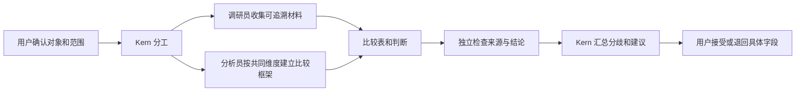

# 数字员工与多 Agent：参考研究及落地建议

日期：2026-10-06。状态：已补充浏览器实际交互观察；基础单页扩展已实施，详见 `digital-workforce-studio-delivery-20261006.md`。产物与工作流等进一步建议仍未实施。与 TASK-011 的 OpenCode 实施说明并行阅读，不扩展其交付范围。

## 1. 参考站点的验证边界

用户提供：https://orbit-agent-workspace.vercel.app/。

最初检索工具无法读取该地址，内置浏览器读取超时，公开 HTTP 读取也失败。用户补充截图并要求继续亲自操作后，通过 Computer Use 选中普通浏览器 Tabbit 的现有 Orbit 窗口，成功读取页面文字和截图，并实际切换任务、员工、工作流、成果文件和上下文面板。

已验证界面导航和员工状态预览联动，未验证真实后台模型执行、数据库持久化或外部动作。员工详情有状态预览控件，调研成果使用 .example 来源域名，显示内容包含演示数据。没有取得源码或许可证信息。不采用搜索中其他同名 Orbit 的介绍来填补空白。

## 2. Kern 现在已有的基础

以下仅确认源码存在，不等同于本轮完成运行验收：

| 层次 | 源码证据 | 下一步要解决的问题 |
| --- | --- | --- |
| 员工身份与能力 | `prisma/schema.prisma` 的 Agent、AgentSkill、模型策略绑定、Squad；Agent 与具体模型分离 | 用户能否看懂职责、可接的工作、缺哪些配置，以及实际交付历史 |
| 团队运行概览 | `src/app/workforce/workforce-client.tsx` 的负载、排队、等待人工、回传复核和团队展示 | 从概览进入具体任务、产物及下一操作的路径是否完整 |
| 委派与交接 | `src/modules/workforce/service.ts` 的 delegateAgentTask、reviewReturnedChildTask 与 AgentDelegation | 子任务摘要如何升级为可追溯、可验收的具体产物交接 |
| 可执行协作图 | `src/modules/supervisor/plan.ts` 的 dependsOn、专业节点、QA、综合与有限返工 | 模板承诺与真实节点、输入输出、验收条件是否一致 |
| 协作路由建议 | `src/modules/assistant-runtime/collaboration-planner.ts` 的 SOLO / SPECIALIST / PAIR / COUNCIL 等，明确 ADVISORY_ONLY | 路由建议不能自动等同于已经执行的团队。service.ts 另有受就绪门禁约束的 SPECIALIST 入队分支 |
| 模型与执行保护 | model-gateway、worker 的账本、预算、执行 token、取消观察与心跳 | 公平调度改动出现新文件，但 TASK-011 尚无独立验收结论 |

## 3. 推荐产品形态

Kern 负责理解目标、组织分工、汇总和向用户汇报；数字员工负责明确专业范围内的产物；工作台让用户看到进展、阻塞和待决策项。

保留三个业务入口：

1. **交办工作**：通过 Kern 输入目标，选定模板，确认对象与范围。
2. **查看团队**：员工职责、可用能力、当前负载、最近交付；“已启用”与“实际可执行”分开显示。
3. **验收成果**：阅读产物、证据、不同意见和下一步，接受、修改或退回具体部分。

员工详情优先显示职责、输入要求、交付类型、工具权限、模型策略和历史结果。长期身份是 Agent，一次工作是 AgentTask / AgentRun；临时讨论不创建永久员工。保留既有组织和项目权限。

## 4. 多 Agent 首个 MVP

使用竞品调研，一次最多两个专业执行者并行，是否增加独立 QA 由场景及预算决定。先跑通小团队交付：

并行只用于独立工作。依赖上游证据的结论必须等待对应产物，不能为了显示多人同时工作而提前生成。普通请求保留单执行者；复杂问题采用并行分工，风险判断才加入复核者。模型数量增加不证明证据独立或质量提高。

协作模板先提供“顺序交接”“并行汇总”“产出后复核”三种，映射既有任务依赖图。流程编辑器可以晚于模板闭环。

## 5. 关键工程补足

### A. 统一产物与交接契约

任务输入引用确定版本的目标、范围和上游产物；输出包含类型、正文或结构化内容、来源关联、缺口和验证状态。交接回执记录发出者、接收者、产物版本及处理结论。

沿用 AgentTask / AgentDelegation / MissionPlan，产物与证据模型结合 TASK-012 / TASK-014 设计，避免另建一套协作任务系统。先明确契约，再决定哪些字段复用快照、哪些需要独立可查询表。

### B. 共享上下文明确范围

共享已确认目标、授权资料和产物引用；专业员工仅获得完成当前工作所需内容。个人会话、其他项目资料、凭证不因加入团队而自动共享。引用产物时保留版本，避免上游修改后下游仍使用旧结论。

### C. 执行、复核、用户接受分开

SUCCEEDED 只说明一次执行完成；来源完整性、比较维度齐全和结论支持需要场景检查；用户接受另有记录。复核者有不同职责和输入核查方式，不能把同一提示重复一次视为独立证据。有限返工只重做受影响节点，保留原因和原版本。

### D. 预算与协作结果可解释

显示真实排队、进行中、阻塞、取消和等待用户，展示已知尝试次数及缺失的 usage。运行时优先保护任务预算、组织公平性和旧执行者撤权。费用未知时保持未知。

未来接入 OpenCode / Codex 等外部执行器时，通过有权限边界的适配器传任务、接状态和产物，定义取消、重试及副作用回执。外部作业不伪装成一次模型 HTTP 调用；这部分不纳入当前 MVP。

## 6. 成本、收益与顺序

| 改进 | 相对投入 | 用户收益 | 主要风险 | 顺序 |
| --- | --- | --- | --- | --- |
| 验收 TASK-011 公平调度 | 中 | 慢请求下其他工作可推进 | 并发竞态、额度和退出回归 | 当前基础门禁 |
| 员工详情和当前工作链接 | 小～中 | 看懂团队职责和实际工作 | UI 把已启用误写成已就绪 | 可独立设计，改动与 OpenCode 调度文件隔离 |
| 产物契约、来源及交接回执 | 中 | 结果可追溯、可以明确接收 | 仅把摘要包装成完成成果 | 配合 TASK-012 |
| 竞品模板与场景验收 | 中 | 一次完整工作能复用 | 多 Agent 观点相同、未核对证据 | 配合 TASK-013 |
| 编辑、版本和定向返工 | 中～大 | 可以持续改进同一份成果 | 下游使用旧版本 | 配合 TASK-014 |
| 行动项、责任人及效果反馈 | 中 | 建议进入实际工作 | 接受建议与实际执行混淆 | 配合 TASK-015 |
| 任意团队编排与外部执行器 | 大 | 更多开放场景 | 权限、成本与维护面扩大 | 前述 MVP 稳定后 |

投入为相对判断，尚无工时估算。现有资产较多，建议先围绕竞品调研补闭环，商业价值以重复交办率、有效成果接受率、人工修订时间及预算内交付率验证。后续可按场景能力、团队席位与运行用量设计收费；当前不以员工数量或可视化节点数量证明付费价值。

## 7. 验收一个真实团队闭环

- 两个专业任务确有独立运行及产物；页面名单与真实执行一致。
- 每个比较字段能够追溯来源；缺证据显示未知，冲突保留。
- 一项复核失败能够退回对应字段 / 节点，生成新版本并重做依赖部分。
- 用户刷新仍回到同一任务和产物版本；终止工作后没有新调用。
- 组织隔离、角色权限、并发预算和账本回归通过。
- 用真实可用模型及检索配置验收调研质量；夹具测试与真实质量结果分别记录。

## 8. Orbit 实际交互观察

| 已操作的界面 | 实际观察 | Kern 可借鉴的改进 |
| --- | --- | --- |
| 首页与固定两侧栏 | 中央统一交办入口，左侧项目 / 员工 / 任务 / 工作流，右侧常驻员工状态；待用户处理项有对应入口 | 用户先交办，执行过程仍能看到团队；将等待人工和配置阻塞集中呈现 |
| 已有落地页任务 | 六步计划与执行时间线；交接明确发出员工、接收员工和文件名；工具事件可展开，页面同时显示待批准与部署阻塞 | 在既有 Mission 事件中呈现产物交接，支持从事件定位产物、依据和问题处理页 |
| 员工目录及 Scout 详情 | 职责、当前工作、模型、工具、只读权限、近期交接；详情以抽屉展开，保持原工作位置 | 员工抽屉由已有 Agent、技能及任务数据驱动，补工具权限和交付记录，减少跳页 |
| 员工状态预览 | 将 Scout 从 Idle 切成 Thinking 后，侧栏、目录、右侧活跃人数及底部同时变化；随后恢复 Idle | 全部视图读同一运行事实源；产品状态由真实事件派生。预览控件只适合明确标识的演示环境 |
| 工作流列表 | 显示成员头像、步骤及上次运行；点击现有流程行未打开详情，页面主要提供启动入口 | 先做可复用模板，同时提供输入、成员、依赖及预算的启动前预览；当前没有观察到自由编排器 |
| 文件列表 → 调研成果 | 文件归属到员工；点击 research.md 可在工作区标签打开阅读，显示作者和来源 | 给产物稳定身份、版本和任务关联，阅读 / 编辑 / 交接围绕同一产物 |
| Context 面板 | 任务、仓库范围、附加文件、权限是否授予及偏好记忆分区展示 | 用户可查看本任务使用的资料和授权范围，不显示凭证本身，不自动跨项目共享 |

没有操作批准、发布、凭证授予、工作流运行或消息发送。浏览期间用户自己交办的新任务不属于 Codex 的测试请求。测试计数、来源统计和费用数字仅为页面显示，不能作为真实执行证据。

### 交互感受与问题

我的体验判断：统一交办入口加上稳定的员工身份，以及具体文件交接，容易形成“我在带一支团队”的感觉。员工抽屉和工作区标签保持上下文；阻塞原因同时出现在时间线与待处理区域，降低寻找问题的成本。

需要改进的细节：左右两侧重复显示员工状态；工作流列表缺少本轮可进入的详情；三栏布局会挤压成果正文；仅凭侧栏“在线”不能证明员工配置可运行。Kern 应保留可折叠侧栏，以成果阅读为主要空间，将等待用户处理的事项提高优先级。

## 9. 从参考到第一批落地

建议第一批仅覆盖：

1. 首页待处理区域：等待补充输入 / 审批 / 配置修复，链接到具体任务和问题。
2. 员工详情抽屉：职责、实际可用能力、权限、当前任务及最近产物。
3. 任务时间线中的交接卡：谁将什么产物的哪个版本交给谁、当前处理结果。

第三项依赖第三阶段产物与来源契约；可先完成展示设计，实施时结合 TASK-012 / TASK-014。头像、状态动效、模板入口使用相同角色标识和真实状态映射，不改变已有执行链或当前 OpenCode 的 TASK-011 范围。

公开仓库仍待提供；取得后再核对后端与许可证条件。当前学习交互和信息组织，不直接复制站点代码或资源。
